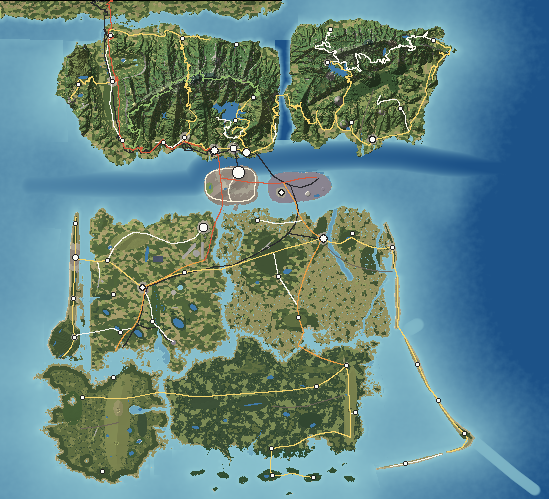

# The Cassena Islands

A modern-day fictional island chain off the southeastern United States, designed as the physical world for an open-world game: mountains, rivers, coasts, forests, towns, roads, railways, ports and power lines, built so that every feature has a geographic reason to be where it is.

This repository holds three things:

1. **The world as data** (`world/`) — islands, mountain ridges, rivers, lakes, settlements, the transport network and seven registers of named places.
2. **The generator and auditor** (`tools/`) — builds a 110 × 100 km terrain on a 50 m grid from that data (erosion, rivers, lakes, bathymetry, graded roads and runways), classifies land cover, and tests every named place against the terrain.
3. **The world bible** (`docs/`) — the design documents, with every number measured from the generated world.
4. **The explorer** (`game/`) — a browser app with a 2D atlas and a 3D free-roam view of the generated islands.



## The world bible

| # | Document | Contents |
|---|---|---|
| 00 | [Research principles](docs/00-research-principles.md) | Environmental design principles extracted from 22 open-world games |
| 01 | [Master geographic framework](docs/01-master-framework.md) | The archipelago: islands, water, mountains, watersheds, climate, connections, island specialisation |
| 02–11 | Island profiles | [Halcomb](docs/islands/halcomb.md) · [Graystone](docs/islands/graystone.md) · [Calder](docs/islands/calder.md) · [Corliss](docs/islands/corliss.md) · [Bellamy](docs/islands/bellamy.md) · [Mirabel](docs/islands/mirabel.md) · [Saint Ambrose](docs/islands/saint-ambrose.md) · [Wickham](docs/islands/wickham.md) · [Ossahatchee](docs/islands/ossahatchee.md) · [Gannet Banks](docs/islands/gannet.md) · [Sabal Keys](docs/islands/sabal.md) — each with geography, geology, visual identity, transport, settlement, exploration, landmarks, atmosphere, environmental storytelling, biomes, infrastructure and inspiration matrix |
| 12 | [Landmark generation](docs/12-landmark-generation.md) | The seven registers: 112 landmarks, 50 viewpoints, 50 beaches, 50 lakes, 50 forests, 50 mountains, 50 districts ([books](docs/registers/)) |
| 13 | [World scale](docs/13-world-scale.md) | Areas, coastlines, drive-time matrix, ferries, highways, railways, bridges, airports, harbours, rivers, elevations |
| 14 | [Exploration density](docs/14-exploration-density.md) | Spacing rules and measured density by island |
| 15 | [Realism audit](docs/15-realism-audit.md) | The seventeen audit questions, automated test results, fixes and remaining compromises |
| 16 | [Atmospheric pass](docs/16-atmospheric-pass.md) | Weather, light, season, sound, palette, vista, road and setting for each region |
| 17 | [Exploration psychology](docs/17-exploration-psychology.md) | Layered visibility, curiosity gaps, landmark chains, contrast, natural discovery |
| 18 | [Writing standard](docs/18-writing-standard.md) | Physical description only; automated vocabulary check |
| 19 | [Inspiration matrix](docs/19-inspiration-matrix.md) | Real-world and game references per island, with reasons |
| 20 | [Final master map](docs/20-master-map.md) | Island index, transport network, natural systems, environmental progression |

## Building

Requires Node.js 18 or later; no dependencies.

```sh
node tools/build.mjs            # terrain (cached in build/) → analysis → docs → images → game data
node tools/build.mjs --no-game  # skip the explorer data export
node tools/atlas.mjs out.png 20 60 50 90 1   # render any box of the map (x0 y0 x1 y1, cells per pixel)
```

The first build generates the terrain (about a minute); later builds reuse it until a source file changes. The build prints any open realism issues; the current world has none.

## The explorer

`game/index.html` loads `game/data/` (terrain and land-cover rasters plus `world.json`) and offers:

- **Atlas** — the whole archipelago with layers for roads, railways, ferries, power lines, places and labels; search across 460 places; and a card for every registered place with its measured data and sightlines.
- **Free roam** — a 3D view of the generated terrain to fly, drive or walk over: engineered roads and bridges, lakes and the sea, towns, forests, landmark structures, ferries, a day–night cycle, a road-cruise mode, a minimap and touch controls.
- **World bible** — every document in `docs/`, readable in the same page.

Serve the repository root with any static server (`python3 -m http.server`) and open `http://localhost:8000/game/`. Controls in free roam: `W A S D` move, drag to look, `R`/`F` up and down, `Shift` faster, `1`/`2`/`3` fly, drive, walk, `C` cruise the nearest road, `[` `]` time of day, `M` back to the atlas.
