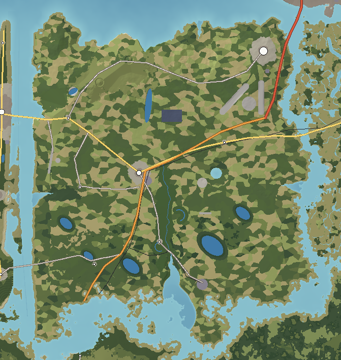

# Bellamy Island — Agricultural

Bellamy is the farm island: 700 km² of the upper coastal plain, the best-drained and most fertile ground in the archipelago. Its fields run in an irregular patchwork of cotton, peanuts, corn and hay between pine woodlots, oval "Carolina bay" lakes and the slow, red Ocosta River. A low line of red-clay hills along its northern shore — locally called mountains at 118 m — is the only relief. Along its north-east corner, where the Long Bridge lands from Calder, the city's suburbs and the international airport have spread over the sandy bluffs.

---

## 1. Geography

**Shape and size.** A broad, square island about 35 km on a side; 696 km² of land; 39 km greatest length; 273 km of coast. Elevation from sea level to 118 m on Iron Mountain; mean elevation 26 m.

**Coastline.**
- *North* (on Cassena Sound): red-clay bluffs up to 30 m, eroding into small coves with dark iron-stained sand (Iron Cove, Sound Bluffs Beach).
- *West* (on Mirabel Sound): a straight, low lagoon shore with marsh and the Mirabel Causeway.
- *South* (on Ketch Sound): an intricate marsh coast where the Ocosta estuary and smaller creeks wind out across mudflats.
- *East* (on the Ashwood River): tidal river shore with marsh islands, facing Saint Ambrose.

**Bays, coves and peninsulas.** The Ocosta estuary (a 6 km drowned river mouth on the south coast), Iron Cove on the north shore, the marsh necks of the south coast.

**Islands offshore.** Mirabel 0.4 km west across Mirabel Sound; Saint Ambrose 0.3 km east across the Ashwood; Wickham 0.3 km south-west and Ossahatchee 0.7 km south across Ketch Sound; Calder 2 km north-east.

**Hills.** The **Red Hills**, a 15 km east–west belt of dissected fall-line sand and clay hills along the north, capped by iron-cemented sandstone: Iron Mountain (118 m), Sugarloaf Hill (104 m, a steep cedar-capped cone). The **Chalybeate Ravines** cut into their western end.

**Valleys and rivers.** The **Ocosta River** (24.1 km, the longest in the islands) rises in the Red Hills, flows south through Lake Ocosta and a broad floodplain with oxbows (Moon Lake, Ox Lake) and enters Ketch Sound through a wide estuary. Tributaries: Little Ocosta, Sweetwater Creek, Mill Branch, Black Creek.

**Lakes and ponds.** Lake Ocosta (a river reservoir), five **Carolina bay** lakes (Clearwater Bay, Tar Kiln Bay, Brown's Bay, Little Bay, Sand Bay — shallow, oval, all aligned north-west to south-east with sand rims on their south-east shores), two oxbows, and the milky-turquoise **Chalk Pits** (flooded kaolin mines).

**Wetlands.** Pocosins (evergreen shrub bogs) around the bays; cypress–gum swamp along Sweetwater Creek; bottomland hardwood along the Ocosta; salt marsh on the south and east coasts.

**Forests.** Longleaf pine on the sandy Red Hills (burned every few years, with wiregrass beneath); slash and loblolly pine plantations in the south; bottomland hardwoods on the floodplain; beech–magnolia in the ravines.

**Cliffs.** The red-clay Sound Bluffs on the north coast.

**Beaches.** Causeway Beach (fill sand), Sound Bluffs Beach (ironstone pebbles), Iron Cove Beach (dark iron-stained sand), Old Bridge Beach (mud and sand on the Ashwood).

**Why it looks like this.** Bellamy is the upper coastal plain: older sea and river deposits lifted a little higher than the land to the south, so it drains well. Its northern edge is the eroded margin of the oldest sediments — the fall-line sand and clay hills — where kaolin clay and iron-cemented sandstone come to the surface. The bays are shallow wind-and-wave-shaped depressions on the old sandy surface; their consistent orientation and sand rims show they formed under the same prevailing winds.

## 2. Geological logic

- **Character:** unconsolidated sand, clay and gravel; kaolin beds in the Red Hills; iron-cemented sandstone caps.
- **Soils:** well-drained sandy loams on the uplands (the best farm soils in the islands); red clay on the hill slopes; deep white sand on the hilltops (longleaf); black, wet organic soils in the bays and swamps; alluvium on the Ocosta floodplain.
- **Erosion:** gullying on red-clay slopes; bluff retreat on the north shore where waves undercut the clay.
- **Sedimentation:** the Ocosta carries red clay to its estuary, colouring Ketch Sound after rain.
- **Drainage:** dendritic, slow, through a few well-defined rivers; large areas of poorly drained flats in the south where the water table is near the surface.
- **Flood-prone:** the Ocosta floodplain (flooded most winters — the bottomland forest is adapted to it); low south-coast fields in storm surge.
- **Coastal erosion:** the Sound Bluffs retreat a few tens of centimetres a year; Iron Cove's seeps undermine them.

## 3. Visual identity

- **Dominant colours:** the green-and-tan patchwork of fields and pine; red clay roads and ploughed fields.
- **Secondary colours:** the white of cotton bolls in autumn; the chalk white and turquoise of the kaolin pits; the black water of the bays; orange iron seeps.
- **Vegetation:** row crops, hedgerows, longleaf savanna with wiregrass, dark pine plantations in straight rows, cypress around the bays.
- **Terrain silhouette:** almost flat; the Red Hills a low, wooded line on the north horizon.
- **Skyline:** the 518 m WCDR-TV mast with its red lights, visible from every field; the Ocosta cooling towers' plumes in the south; the Bellamy grain elevator; the peanut-shaped water tower.
- **Architecture:** a domed county courthouse in a square of brick storefronts; farmhouses with deep porches; metal equipment sheds and centre-pivot irrigation rigs; a cotton gin and peanut shellers by the railway; brick ranch houses and strip malls on the Bluffs.
- **Coastline:** marsh and mudflat in the south, red bluffs in the north.
- **Atmosphere:** open sky, heat haze over fields, dust behind tractors, towering summer cumulus.
- **Signature feature:** **the WCDR-TV mast above the fields** — and the pattern of oval bays from the air.

## 4. Transportation geography

**Highways.**
- **I-21** lands from Calder on the **Long Bridge** (3,475 m: a low trestle with a high-rise navigation hump, 38 m clearance) at the Bellamy Bluffs and ends at Calder International Airport (8 km on the island).
- **SR 9 Bellamy Highway** (4-lane, 27.5 km): continues south from the airport through Kinard and Bellamy town to Dunmore and the Wickham ferry — the farm-to-market spine.
- **SR 40 Cross-Island Highway** (52.9 km): west–east across the island from the Mirabel Causeway through Harlow and Bellamy to the **Ashwood River Bridge** (550 m concrete high-rise, 20 m clearance) and Haversham.
- **County roads:** Red Hills Road (CR 14) along the hills from Harlow to the Bluffs; Ocosta River Road (CR 9) to Ocosta village and the nuclear station; Serena Causeway (CR 30) to Mirabel's south end; Airport Road (CR 41) to the regional airport.
- **Farm and dirt roads:** a dense grid of red-clay and sand roads between fields, many unpaved; firebreaks through the longleaf; logging roads in the plantations.

**Bridges.** The Long Bridge, the **Mirabel Causeway** (a 2.1 km causeway with a bascule span over the inland waterway, 7 m clearance), the **Serena Causeway Bridge** (1.9 km causeway with a 19 m high-rise span), the Ashwood River Bridge, and the **Ashwood Swing Bridge** (1,100 m railway trestle with a centre-pier swing span, 3 m clearance closed) beside the piers of the old road bridge.

**Railroads.** The **Bellamy & Southern Railway** (54 km, freight) from Corliss across Saint Ambrose and the Ashwood Swing Bridge to Bellamy's depot district (cotton gin, peanut shellers, grain elevator) and south to Dunmore; the **Ocosta Station Spur** (8.8 km) to the nuclear plant; sidings at Kinard (grain elevator).

**Aviation.**
- **Calder International Airport** on the Bellamy Bluffs: two runways, 05/23 (3,400 m) and 18/36 (2,800 m), on the flattest high ground near the city, with a terminal, cargo sheds and the Airport Commerce Park.
- **Mirabel–Bellamy Regional Airport** (01/19, 2,430 m) on the west coast between Harlow and the causeway, serving the resort coast.
- **Ocosta Ag Strip** (09/27, 1,000 m grass) for crop dusters.

**Maritime.** Boat ramps on the Ocosta estuary and the Ashwood; a fishing walkway on the old swing-bridge piers; the Wickham cable-ferry landing at the south-west tip.

## 5. Settlement pattern

| Settlement | Population | Why it is here |
|---|---|---|
| Bellamy Bluffs | 38,000 | High, dry sandy bluffs at the south end of the Long Bridge — Calder's nearest buildable mainland, between the interstate and the airport. |
| Bellamy | 14,000 | Courthouse town in the middle of the farm plain where the two highways and the railway cross the Ocosta. |
| Ocosta | 2,200 | River landing at the head of the Ocosta estuary, the upper limit of tidewater barges. |
| Harlow | 1,600 | Red Hills market village beside the kaolin pits and the causeway road. |
| Kinard | 900 | Railway crossroads with a grain elevator between Bellamy and the Ashwood. |
| Sweetwater | 700 | Farm hamlet on Sweetwater Creek. |
| Dunmore | 600 | Flatwoods hamlet on the road to the Wickham ferry. |

**Rural pattern.** Farmsteads every 1–2 km along the roads, each with a house set back under oaks, equipment sheds, grain bins and a pond; tenant houses and tobacco and cotton barns in various states; churches and country stores at crossroads. **Roadside business** along SR 9 and at the I-21 terminus. **Industry:** the Depot District, the nuclear station, the airport cargo area, the Bluffs Logistics Park. **Suburbs** spread only around the Bluffs — the rest of the island is far enough from Calder to stay rural.

## 6. Exploration design

- **Unpaved roads:** red-clay roads between fields that lead to bays, cemeteries, gins and abandoned houses.
- **The bays:** each oval lake is hidden inside a ring of pocosin; a white sand rim on the south-east side makes a natural beach (Sand Bay).
- **Red Hills:** ravines with iron seeps, kaolin pits with turquoise water, the cedar-capped Sugarloaf with its survey post.
- **Ocosta River:** a canoe trail through bottomland forest past oxbows.
- **Abandoned places:** the Bellamy drive-in screen beside SR 9; Ocosta Shores — paved streets, signs and fire hydrants without houses, in young pines.
- **Contrast:** the nuclear cooling towers rising behind longleaf savanna; the 518 m mast standing alone over fields.

## 7. Visual landmark system

- **Primary:** the Ocosta Cooling Towers (seen from 18% of all land, their plumes from much more), the WCDR-TV Mast (42% — the most widely visible structure in the islands), the Long Bridge.
- **Secondary:** the Bellamy Grain Elevator, the Peanut Water Tower, the Bellamy Solar Farm.
- **Local:** Ocosta Shores, the Bellamy Drive-In Screen.
- **Micro:** the Iron Cove Seeps, the Sugarloaf Survey Marker.

## 8. Atmosphere

**Weather.** Hot, humid summers; sea breezes from the Gulf and Atlantic meet over the middle of the island and build thunderstorms almost every afternoon from June to September — anvil clouds over fields are the island's sky. Mild winters with frost on clear nights. Occasional tropical storms flood the Ocosta.

**Fog.** Radiation fog in the Ocosta bottoms and over the bays on autumn and winter mornings; ground fog lying in field hollows.

**Lighting.**
- *Sunrise:* mist over fields and the bays, the mast's red lights fading.
- *Morning:* long shadows of hedgerows and pines across fields.
- *Noon:* white heat, flat colour.
- *Afternoon:* storm shadows racing over the patchwork.
- *Golden hour:* cotton and wiregrass glow; dust behind a tractor.
- *Sunset:* across Mirabel Sound from the causeway.
- *Blue hour:* the mast's lights and the cooling tower plumes lit pink.
- *Night:* very dark between towns; the airport and the Bluffs glow on the north-east horizon.

**Seasons.** *Spring*: ploughing, red fields, dogwoods at woods' edges, planting. *Summer*: corn high, cotton in flower, thunderstorms. *Autumn*: cotton open and white, peanut harvest, dust. *Winter*: bare red fields, brown broom sedge, longleaf green.

## 9. Environmental storytelling (physical evidence only)

- Paved streets, stop signs and fire hydrants stand in young pine forest with no houses.
- A drive-in screen tower stands in a field of weeds beside the highway.
- Concrete piers of an old road bridge carry a fishing walkway beside the railway swing bridge.
- A tar kiln mound sits on the sand rim of a bay.
- Tenant houses lean in the middle of fields; chimneys stand in hedgerows.
- Solar panels cover a field with old cotton rows still visible between them.
- Kaolin pits flooded turquoise, with chalk-white spoil banks and rusting conveyors.

## 10. Biome distribution

| Zone | Where | Why |
|---|---|---|
| Cropland and pasture (the majority of open land) | Well-drained uplands | The best soils in the islands. |
| Longleaf savanna | Deep sands of the Red Hills | Dry, fire-maintained. |
| Pine plantation | Poorly drained southern flats | Too wet for row crops, good for pine. |
| Bottomland hardwood | Ocosta floodplain | Seasonally flooded. |
| Pocosin (bay forest) | Rims of the Carolina bays | Saturated organic soils. |
| Cypress–gum swamp | Sweetwater Creek | Permanently wet. |
| Beech–magnolia ravines | Chalybeate Ravines | Shaded, moist ravines in the hills. |
| Salt marsh | South and east shores | Sheltered tidal flats. |
| Suburban and commercial | The Bluffs | Next to the bridge and airport. |

## 11. Human infrastructure

- **Power:** **Ocosta Nuclear Station** (2,300 MW, two hyperbolic cooling towers, 165 m) beside the Ocosta estuary; 500 kV lines north to the Bellamy Substation and the Bluffs Substation by the airport; **Bellamy Solar Farm** (150 MW) on old cotton fields.
- **Water:** Ocosta Water Plant drawing from Lake Ocosta; water towers in every town (the Peanut Water Tower in Bellamy).
- **Sewage:** small plants at Bellamy and the Bluffs.
- **Communications:** the 518 m WCDR-TV mast (guyed, its anchors spread over 300 m of farmland); cell towers along SR 9.
- **Agricultural industry:** the Bellamy Peanut Shellers and Cotton Gin, grain elevators at Bellamy and Kinard, fertiliser and equipment dealers.
- **Distribution:** the Bluffs Logistics Park along I-21.
- **Landfill:** Bellamy County Landfill (a fenced mound in the pines).
- **Quarry:** Harlow Kaolin Pits.
- **Drainage:** straight farm ditches draining the southern flats into Ketch Sound.

## Inspiration matrix

| Category | Inspiration | Why |
|---|---|---|
| Real-world geography | Georgia and South Carolina upper coastal plain; the fall-line sandhills and kaolin belt; Carolina bays | A well-drained farm plain with fall-line hills and oval bays is the real heart of southeastern agriculture. |
| Architecture | South Georgia courthouse towns; cotton gins, peanut shellers and grain elevators | The rural service-town pattern of the coastal-plain South. |
| Vegetation | Longleaf–wiregrass, bottomland hardwoods, pocosins | Each tied to a specific soil and water condition. |
| Atmosphere | *Red Dead Redemption 2* (the Heartlands) | Wide sky, storm clouds over farmland. |
| Exploration design | *Far Cry 5* | Rural infrastructure — silos, towers, back roads — as the things to explore. |
| Landmark philosophy | *Fallout: New Vegas* | A single tall, lit mast seen across open land. |
| Environmental storytelling | *Days Gone* | Roads and developments abandoned to the forest. |

<!-- BEGIN GENERATED -->
### Measured from the generated terrain

| Measure | Value |
|---|---|
| Land area | 696 km² |
| Inland water | 10.2 km² |
| Sea coastline | 273 km |
| Greatest length | 38.9 km |
| Highest point | Iron Mountain, 118 m |
| Mean elevation | 26 m |
| Land below 3 m | 9% |
| Slopes steeper than 40% | 0% |
| Population | 58,000 |
| Longest drive | Dunmore – Bellamy Bluffs, 43.5 km, 38 min |
| Register entries | 10 landmarks, 3 viewpoints, 4 beaches, 9 lakes, 6 forests, 2 summits, 4 districts |

**Land cover (share of land area)**

| Cover | Share | km² |
|---|---|---|
| Pine plantation | 21.2% | 147.4 |
| Cropland | 18.6% | 129.7 |
| Pine–hardwood forest | 16.0% | 111.0 |
| Pasture and hay | 14.3% | 99.6 |
| Salt marsh (cordgrass, needlerush) | 5.5% | 38.1 |
| Orchards (pecan, peach, apple) | 5.3% | 36.7 |
| Slash-pine flatwoods | 5.3% | 36.5 |
| Longleaf pine savanna | 3.3% | 23.0 |
| Cypress–tupelo swamp | 3.0% | 21.1 |
| Bottomland hardwoods | 3.0% | 20.6 |
| Suburban | 1.2% | 8.7 |
| Bay forest and pocosin | 1.2% | 8.1 |
| Airport | 1.0% | 7.1 |

**Settlements**

| Settlement | Form | Population | Why here |
|---|---|---|---|
| Bellamy Bluffs | suburb | 38,000 | Sandy bluffs at the south end of the Long Bridge: the nearest high, dry ground to the city between the interstate landing and the airport. |
| Bellamy | town | 14,000 | Courthouse town in the middle of the farm plain where the state highways and the shortline railroad cross the Ocosta. |
| Ocosta | village | 2,200 | River landing at the head of the Ocosta estuary, the upper limit of tidewater barge navigation. |
| Harlow | village | 1,600 | Red Hills market village near the kaolin pits. |
| Kinard | village | 900 | Crossroads and grain elevator on the railroad between Bellamy and the Ashwood River bridge. |
| Sweetwater | hamlet | 700 | Farm hamlet on Sweetwater Creek. |
| Dunmore | hamlet | 600 | Flatwoods hamlet on the road to the Wickham ferry. |

**Rivers**

| River | Length | Fall | Gradient |
|---|---|---|---|
| Ocosta River | 24.1 km | 56 m | 2.3 m/km |
| Little Ocosta | 16.3 km | 74 m | 4.6 m/km |
| Sweetwater Creek | 8.3 km | 25 m | 3.0 m/km |
| Mill Branch | 7.0 km | 61 m | 8.6 m/km |
| Black Creek | 6.6 km | 24 m | 3.7 m/km |
<!-- END GENERATED -->
