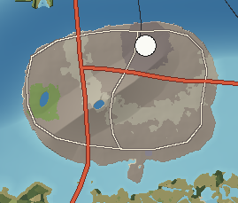

# Calder Island — Dense Urban

Calder is a city on a rock. The island is a 92 m granite knob at the mouth of the Tennalee, set in the deepest water of Cassena Sound, at the point where ocean ships meet river barges and where the only practical crossings from the mountains to the coastal plain converge. It has every reason a city can have and only 74 km² to have them on, so it built up instead of out: a tight high-rise core on the bluff, a mid-rise ring, Victorian streets on the ridge, and a hard seawall edge on every side.

---

## 1. Geography

**Shape and size.** An oval 11 km east–west and 7 km north–south with a filled lobe on its south-east side. Land area 74 km², 36 km of shore, elevation from sea level to 92 m at Calder Heights.

**Coastline.** Almost entirely built: seawalls, bulkheads, wharves and promenades. Natural shore survives only in Westside Park (a sand beach rebuilt with imported sand) and below the South Shore seawall.

**Bays and points.** Calder Point (the north-east tip with the harbour light), the Inner Harbor (a deep, narrow channel between Calder and Corliss), the North Channel (between Calder and Halcomb), the Yacht Basin on the south-west shore.

**Islands offshore.** Halcomb 1.5 km north across the North Channel; Corliss 2.0 km east across the Inner Harbor; Bellamy 2.0 km south across the Long Bridge; Saint Ambrose 0.7 km south-east.

**Hills and ridges.** **Calder Heights**, a granite ridge running east–west through the island's centre, highest at 92 m, carrying a reservoir and a broadcast tower. The bluff at the north-east end, above the river mouth, is where downtown stands.

**Valleys and streams.** Mill Creek once ran south off the Heights in a shallow valley; it now runs in a brick culvert under the rowhouses and comes out through a stone arch into the harbour.

**Lakes.** Heights Reservoir (a city reservoir on the summit) and Lake Ellery (a cypress-edged park lake in Westside Park, on the site of a natural pond).

**Forests and parks.** Westside Park's oak woods; street trees (live oak, water oak, crape myrtle) throughout the Heights.

**Beaches.** Westside Park Beach (urban, imported sand), South Shore Beach (narrow and mixed, below the seawall).

**Why it looks like this.** Calder is a bedrock outlier of the highland rocks, left standing in the rift trough when the Sound subsided around it. That gives it what no other site in the Sound has: firm granite foundations for tall buildings, a bluff above flood level, and deep water right against its north-east shore where the Tennalee has scoured its mouth.

## 2. Geological logic

- **Character:** a granite and gneiss knob surrounded by marsh mud and sand; most of its southern lobe is fill.
- **Soils:** thin soils over rock on the Heights; artificial fill (dredge spoil, rubble) around the edges.
- **Erosion and sedimentation:** the Tennalee scours the north-east shore (keeping the harbour deep) and drops sediment in the slack water to the south and west, which is why the yacht basin needs dredging and the city wharves do not.
- **Drainage:** short storm drains straight to the harbour; Mill Creek is culverted.
- **Flood-prone:** all filled land below 3 m — Southside, the Stadium District, the Yacht Basin — floods in storm surge; the seawalls are 3–4 m high.
- **Landslide-prone:** none of significance; rockfall from the old quarried face behind Hospital Hill.
- **Coastal erosion:** none; the shore is armoured.

## 3. Visual identity

- **Dominant colours:** glass blue and limestone cream downtown; red brick and painted wood in the old districts.
- **Secondary colours:** green copper roofs and the live-oak canopy of the Heights; the red cast-iron harbour light; the orange-red steel of the lift-bridge towers.
- **Vegetation:** live oaks and water oaks on the Heights, palms along the South Shore promenade, cypress in Lake Ellery.
- **Terrain silhouette:** a low dome (the Heights) with a broadcast tower on top, and a cluster of towers on the north-east bluff — the skyline seems to rise straight out of the water.
- **Skyline:** Calder Tower (64 storeys, 268 m, stepped crown and lit spire), a dozen towers of 150–200 m around it, the Calder Heights broadcast tower (210 m) behind, and the station clock tower among them.
- **Architecture:** a tight grid of brick warehouses and cobbled streets along the wharves; glass and limestone towers on the bluff; painted rowhouses with deep porches; Victorian and Colonial Revival houses under oaks on the Heights; brick university quadrangles; converted kilns and chimneys in the Brickyard.
- **Coastline appearance:** seawalls, promenades, wharves and piers; cruise ships at the terminal.
- **Atmosphere:** humid haze; heat shimmering off pavement; fog in the harbour on winter mornings.
- **Signature feature:** **the skyline seen from the Tennalee River Bridge**, rising from the water with the mountains behind.

## 4. Transportation geography

**Highways.**
- **I-21** enters from Halcomb over the **Tennalee River Bridge** (2,100 m concrete segmental box girder, 24 m clearance — high enough for barge tows) and crosses the island's west side (7.5 km on Calder) before leaving south over the **Long Bridge** (3.5 km) to Bellamy.
- **I-121** (the port spur) leaves I-21 at the west side interchange and runs east across the middle of the island, just north of the Heights, to the **Harbor Bridge** (1,850 m steel girder with a bascule span) to Corliss.

**Arterials and streets.**
- **Bay Avenue** along the north shore, **Harbor Boulevard** down the east side, **Heights Avenue** north–south over the ridge, **South Shore Drive** and **West Shore Drive** round the bay sides — five arterials that together ring the island.
- A tight grid downtown and in Old Market; curving streets that follow the contours on the Heights; a regular suburban grid on the southern fill.

**Bridges.** The Tennalee River Bridge, the Long Bridge, the Harbor Bridge and the **Market Street Bridge** (1,400 m double-deck vertical lift: road above, rail below; its towers lift the span for river traffic). The North Channel is narrowest at the Market Street crossing, which is why the oldest bridge is there.

**Railroads.** The **Calder Passenger Branch** comes from Tennalee Junction on Halcomb across the Market Street Bridge's lower deck to **Calder Central** in Station Square (granite station with a clock tower). Freight bypasses the island entirely on the Corliss Lift Bridge.

**Aviation.** No airport on the island (no room). Calder International is 15 minutes away on the Bellamy Bluffs. **Calder Downtown Heliport** on a pier by the ferry terminal; a rooftop helipad at Calder General Hospital.

**Maritime.** **Calder Wharves and Cruise Terminal** (12 m alongside, measured 25 m in the scoured river mouth); the **Graystone ferry terminal** at Ferry Landing; the seasonal fast-ferry pier to Mirabel on the west shore; the **Calder Yacht Basin** (marinas, dry stack storage) on the south-west shore; water taxis between Old Market, Riverside and Corliss.

## 5. Settlement pattern

The whole island is one city of 362,000 — about 4,900 people per km², comparable to the densest American cores. Its structure follows the ground:

| District type | Where | Why |
|---|---|---|
| High-rise core (Downtown) | The north-east bluff | Firm granite, above floods, next to deep water and the bridges. |
| Historic waterfront (Old Market, Calder Point, Harborside, Cotton Exchange) | Along the wharves | The first ground built on, next to the ships. |
| Transit hub (Station Square) | Behind downtown | Where the rail branch lands from the lift bridge. |
| Mid-rise ring (Midtown, Uptown) | Along the main avenues south and west of downtown | Growth outward from the core along transit. |
| Victorian residential (The Heights, Reservoir Hill) | The granite ridge | High, cool, breezy ground with views — always the richer neighbourhoods. |
| Rowhouses (Mill Creek, Cypress Row) | Low ground near the harbour | Dense working neighbourhoods near the port jobs. |
| Institutional (Hospital Hill, University) | Shoulders of the Heights | Large flat lots on firm ground. |
| Industrial and utilities (Southside, Gasworks, Brickyard) | Filled land and the west side | Away from the core, on cheap reclaimed land. |
| Recreation (Ellery Park, Stadium District, Fairgrounds, Yacht Basin) | West and south fill | Large open sites. |

Suburbs have nowhere to go on the island, so they spill north to Halcomb Heights and Riverside and south to the Bellamy Bluffs — the metropolitan area (with Riverside, Halcomb Heights, Tennalee Falls and Bellamy Bluffs) is about 480,000 across three islands.

## 6. Exploration design

- **Rooftops and decks:** the Calder Tower observation deck; the reservoir promenade on the Heights; the Tennalee River Bridge crest.
- **Hidden routes:** the Mill Creek culvert behind its stone outfall; the old rail spur along the wharves; alleys and stairs down the Heights' south face.
- **Old structures:** the iron gasholder frame enclosing a park; kilns and chimneys in the Brickyard; the cotton exchange; the red cast-iron harbour light.
- **Waterfront walks:** the seawall promenades round the whole island; piers into the Inner Harbor.
- **Contrast:** from Calder Point, the Corliss stacks and cranes fill the view 2 km across the harbour; from the north shore, the 2,000 m mountains of Halcomb.

## 7. Visual landmark system

- **Primary:** Calder Tower, the Calder Heights Tower, the Tennalee River Bridge.
- **Secondary:** the Calder Central Clock Tower, the Market Street Bridge, Calder Stadium, Calder Harbor Light.
- **Micro:** the Gasholder Ring, the Mill Creek Outfall.

## 8. Atmosphere

**Weather.** Hot, humid summers with afternoon storms rolling in from the mountains to the north; mild winters with clear, cold, high-visibility days after fronts; heavy rain and surge in tropical storms.

**Fog.** Harbour fog on still winter mornings, with the tower tops above it; steam from the Corliss stacks drifting across the harbour.

**Lighting.**
- *Sunrise:* behind Corliss — the stacks and cranes in silhouette, the towers catching the first light.
- *Morning:* long shadows down the grid.
- *Noon:* glare off glass; heat on the pavement.
- *Afternoon:* storm clouds over Halcomb.
- *Golden hour:* the skyline lit from the south-west, seen from the Tennalee River Bridge.
- *Sunset:* from Westside Park, over the bay.
- *Blue hour:* office lights come on; the spire of Calder Tower lights up.
- *Night:* the island glows; the bridges are lines of lights; red aircraft lights blink on the towers and the broadcast mast.

**Seasons.** Spring azaleas on the Heights; summer heat; autumn the clearest, most comfortable season; winter grey and occasionally frosty.

## 9. Environmental storytelling (physical evidence only)

- An iron gasholder frame stands empty around a park.
- A stone arch opens in the harbour wall with a stream flowing out of it, and no stream visible above.
- Brick warehouses carry painted names of commodities on their walls; their loading doors are now shop windows.
- Rail tracks set in cobbles along the wharves run under parked cars and stop at a bollard.
- Kilns and a chimney stand among new loft buildings in the Brickyard.

## 10. Biome distribution

Urban core and urban fabric cover almost everything. Vegetation: the oak woods and cypress lake of Westside Park; street-tree canopy on the Heights; palms and lawns on the promenades; marsh grass only in a small restored edge by the yacht basin.

## 11. Human infrastructure

- **Power:** Calder North Substation, fed by 230 kV lines from the Tennalee Falls Substation (across the North Channel), from Corliss and from the Bluffs Substation on Bellamy.
- **Water:** Heights Reservoir (treated water storage on the summit, gravity-fed to the city); water from Tennalee Water Works.
- **Sewage:** Calder Southside Treatment Plant on reclaimed land.
- **Communications:** the 210 m Calder Heights broadcast tower; rooftop antennas downtown.
- **Freight and warehouses:** Southside truck yards; cruise and breakbulk wharves.
- **Construction:** at any time two or three tower cranes over downtown; a new seawall section being cast on the South Shore.
- **Utility corridors:** transmission lines enter on towers across the North Channel and descend into the substation.

## Inspiration matrix

| Category | Inspiration | Why |
|---|---|---|
| Real-world geography | Charleston (SC) and Savannah (GA) for a port at a river mouth on a bluff; Jacksonville (FL) for a river city with many bridges | A southern port city at a tidal river mouth, ringed by marsh and bridges. |
| Architecture | Savannah and Charleston waterfront warehouses and rowhouses; mid-century and contemporary southern downtowns | Brick waterfront, porch-fronted rowhouses, and a modern glass core. |
| Vegetation | Lowcountry city streets: live oak, palmetto, crape myrtle | The coastal-plain street tree palette. |
| Atmosphere | *Cyberpunk 2077* | Vertical density, wet light at night. |
| Exploration design | *GTA V* | A legible urban hierarchy you can learn by driving. |
| Landmark philosophy | *Assassin's Creed* | A few tall, distinct structures for orientation across a dense city. |
| Environmental storytelling | *Fallout 4* | Old industrial structures absorbed into a living city. |

<!-- BEGIN GENERATED -->
### Measured from the generated terrain

| Measure | Value |
|---|---|
| Land area | 74 km² |
| Inland water | 0.5 km² |
| Sea coastline | 36 km |
| Greatest length | 10.9 km |
| Highest point | Calder Heights, 92 m |
| Mean elevation | 18 m |
| Land below 3 m | 6% |
| Slopes steeper than 40% | 0% |
| Population | 362,000 |
| Longest drive | Calder – Calder, 0.0 km, 0 min |
| Register entries | 9 landmarks, 3 viewpoints, 2 beaches, 2 lakes, 1 forests, 1 summits, 25 districts |

**Land cover (share of land area)**

| Cover | Share | km² |
|---|---|---|
| Urban | 69.3% | 51.6 |
| Suburban | 17.8% | 13.2 |
| Urban core | 8.8% | 6.6 |
| Parks and golf courses | 3.8% | 2.8 |

**Settlements**

| Settlement | Form | Population | Why here |
|---|---|---|---|
| Calder | city | 362,000 | Bedrock island at the mouth of the Tennalee, beside the deepest natural water in Cassena Sound; head of ocean navigation and the first high, dry ground below the falls. |
<!-- END GENERATED -->
