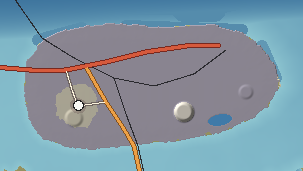

# Corliss Island — Industrial

Corliss is flat, made land beside deep water. Half of it is old delta mud at the edge of the Tennalee's outflow and half is dredge spoil piled up from deepening the ship channel. It has what heavy industry needs and nothing a city wants: 15 m of water at the quay, room for rail yards and tank farms, a power supply on the island, and no neighbours to complain. Two 180 m red-and-white stacks, eight container cranes and a refinery flare make it the most recognisable skyline in the Sound after Calder's.

---

## 1. Geography

**Shape and size.** A flat lozenge 12.5 km east–west and 4–5 km north–south; 66 km² of land; 32 km of shore. Natural ground rarely exceeds 4 m; the highest point is the capped Corliss Landfill at 48 m, with two flat-topped dredge-spoil mounds (18 m and 14 m).

**Coastline.** The north shore is a straight line of quays and berths on the ship channel; the west faces the Inner Harbor and Calder; the south shore is a salt-marsh fringe facing Saint Ambrose; the east tip is a sand spit of dredged material (Spoil Island Beach) beside the shipyard.

**Bays.** The **Corliss Turning Basin**, a dredged circle 1.2 km across in front of the container berths where ships swing round.

**Islands offshore.** Calder 2 km west; Saint Ambrose 2.1 km south; Halcomb 4.7 km north; Graystone 4.8 km north-east.

**Hills, rivers, lakes.** No natural relief or rivers. One water body: the **Corliss Cooling Pond**, an industrial pond beside the generating station.

**Wetlands.** Salt marsh survives along the south shore, between the paper mill and the sound.

**Why it looks like this.** The Tennalee carries mud out of the mountains; where its current slackens east of Calder, the mud settled into marsh islands. Every deepening of the ship channel since then has dumped spoil on those marshes, raising them into dry, flat ground. Industry came because the ships were already passing its front door.

## 2. Geological logic

- **Character:** soft delta clay and silt under a cap of dredged sand and shell; no rock within 30 m of the surface.
- **Soils:** made ground: sand, shell, slag and rubble.
- **Subsidence:** the soft clay compresses under heavy loads; tank farms sit on piles, older warehouses lean.
- **Drainage:** pumped; ditches and tide gates on the south shore.
- **Flood-prone:** everything below 3 m — most of the island — in storm surge; the industrial plants are walled.
- **Coastal erosion:** the unarmoured south marsh edge erodes slowly; the dredge-spoil spit grows each time the channel is maintained.

## 3. Visual identity

- **Dominant colours:** industrial grey, rust and the white of tanks.
- **Secondary colours:** the red-and-white bands at the top of the Corliss Stacks; container stacks in every colour; the orange of the gantry cranes; the yellow flare.
- **Vegetation:** salt marsh on the south edge; weedy lots; grass on the capped landfill.
- **Terrain silhouette:** flat, with one green hill (the landfill).
- **Skyline:** two 180 m stacks, eight cranes with booms raised, the shipyard's goliath crane, the paper mill's steam plumes, distillation columns and a flare.
- **Architecture:** shotgun houses, bungalows and corner stores in Corliss Town; sheds, tanks, pipe racks, conveyor bridges.
- **Coastline appearance:** concrete quays, steel sheet piling, tugboats and ships alongside.
- **Atmosphere:** steam and haze, the smell of the paper mill on a south wind, sodium lights at night.
- **Signature feature:** **the Corliss Stacks** with the cranes in front of them.

## 4. Transportation geography

**Highways.** **I-121** arrives from Calder over the **Harbor Bridge** (1,850 m, steel girder with a bascule span over the Inner Harbor) and runs the length of the island to the container terminal gate — about 10 km of interstate on the island, built for container trucks. **SR 17 Coastal Highway** leaves Corliss Town south over the **South Sound Bridge** (3,000 m twin concrete trestles) to Saint Ambrose.

**Industrial roads.** A grid of wide, straight haul roads with rail crossings, truck queuing lanes at the terminal gate and gated plant roads.

**Railroads.** The **Corliss Freight Line** comes from Tennalee Junction across the Sound on the **Corliss Lift Bridge** — a 5.2 km low trestle with a vertical-lift span (46 m clearance raised) over the ship channel — into a yard in the middle of the island, with spurs to every plant. The **Bellamy & Southern** begins here and crosses the South Sound Rail Bridge (a timber trestle with a swing span) to Saint Ambrose.

**Aviation.** None (the stacks and cranes are obstructions). The nearest heliport is in downtown Calder.

**Maritime.**
| Facility | Depth | What |
|---|---|---|
| Corliss Container Terminal | 15.5 m | Eight ship-to-shore cranes on the north quay |
| Corliss Bulk & Tank Berths | 14 m | Petroleum, coal and aggregate |
| Corliss Shipyard | 11 m | Drydocks, slipways, goliath crane |
| Tug and pilot station | — | At the turning basin |

The ship channel follows the Cassena Trough from the Atlantic to the turning basin, maintained at 15.5 m.

## 5. Settlement pattern

| Settlement | Population | Why |
|---|---|---|
| Corliss Town | 14,000 | The highest, driest ground on the island's west end, within walking distance of the port and mills and nearest to Calder. |

There is no rural land and no suburb: housing stops where the industrial zones begin. A strip of diners, bars and truck-parts shops runs along the main road between town and the terminal gate.

**Industrial districts.** Container Terminal (north-east), Refinery Row (north-west), the paper mill (centre-south), the generating station (east), the Shipyard (east tip), a scrap and recycling yard near the Harbor Bridge.

## 6. Exploration design

- **Landfill Hill:** a grassed, capped mound with gas vents — the only high ground, with a view of every structure on the island and of Calder's skyline.
- **The south marsh edge:** a dirt track along the levee between the mill and the sound.
- **The spoil spit:** an unofficial beach of dredged sand beside the shipyard, with shells and ship-watching.
- **The Sunken Dredge:** a hulk resting on a sandbar off the south-east shore, its superstructure above water.
- **Rail yards and pipe racks:** gated, but visible from overpasses.

## 7. Visual landmark system

- **Primary:** the Corliss Stacks, the Corliss Gantry Cranes.
- **Secondary:** the Corliss Lift Bridge, the Harbor Bridge, Corliss Landfill Hill, the Shipyard Goliath Crane, the Refinery Flare.
- **Local:** the Sunken Dredge.
- **Micro:** the Paper Mill Whistle — heard across the island at shift change.

## 8. Atmosphere

**Weather.** As Calder: humid summers, afternoon storms, clear cold winter days; exposed to wind from every side.

**Fog.** Harbour fog in winter mornings mixing with plant steam into a low, opaque layer; the cranes rise above it.

**Lighting.**
- *Sunrise:* behind the shipyard — goliath crane and ships in silhouette.
- *Morning:* steam plumes lit gold.
- *Noon:* flat glare off tanks and containers.
- *Afternoon:* thunderheads over the mountains to the north behind the stacks.
- *Golden hour:* the red-and-white stack bands glow.
- *Sunset:* behind Calder's skyline, seen from Landfill Hill.
- *Blue hour:* sodium lights come on; the flare brightens.
- *Night:* the terminal lit like a stadium, crane lights moving, the flare.

**Seasons.** Little visible seasonal change except the marsh — green in summer, gold in autumn, brown in winter.

## 9. Environmental storytelling (physical evidence only)

- Two tall stacks with no smoke stand beside a newer, lower building that steams.
- A dredge hulk sits on a sandbar off the shore.
- Old warehouses lean on settling ground; newer ones stand on piles.
- A capped hill with gas vents and monitoring wells rises out of the flat island.
- Rails run into the marsh on the south side and stop at a timber bulkhead.

## 10. Biome distribution

Industrial land covers most of the island; salt marsh survives on the south shore below 1.4 m; grassland on the capped landfill and spoil mounds; street trees in Corliss Town.

## 11. Human infrastructure

- **Power:** **Corliss Generating Station** — 1,850 MW gas combined-cycle with two retired coal stacks — feeding the Corliss Substation and 230 kV lines to Calder and to Haversham.
- **Water:** the cooling pond; industrial water from wells; potable water piped from Calder.
- **Sewage:** Corliss Industrial Wastewater plant at the east end.
- **Waste:** Corliss Landfill (capped), Corliss Scrap and Recycling yard.
- **Fuel:** refinery tank farm and petroleum berths.
- **Utility corridors:** pipe racks and conveyor bridges between plants; transmission lines leaving westward over the Inner Harbor.
- **Construction:** a new crane rail being laid on an extension of the container quay.

## Inspiration matrix

| Category | Inspiration | Why |
|---|---|---|
| Real-world geography | Port terminals on dredge-spoil islands in Savannah, Jacksonville and Charleston harbours | Ports in the Southeast grow on made land beside dredged channels. |
| Architecture | Gulf and Atlantic coast refinery and paper-mill towns | Shotgun houses and mill-town bungalows under stacks. |
| Vegetation | Disturbed coastal land and salt-marsh edges | Weeds, grass caps and marsh on the margins. |
| Atmosphere | *STALKER* | Silence, steam and industrial scale. |
| Exploration design | *GTA V* (the port) | An industrial district readable as a set of distinct machines. |
| Landmark philosophy | *Metro Exodus* | Cranes and stacks as horizon markers. |
| Environmental storytelling | *Fallout 4* | Old and new industrial structures side by side, unexplained. |

<!-- BEGIN GENERATED -->
### Measured from the generated terrain

| Measure | Value |
|---|---|
| Land area | 66 km² |
| Inland water | 0.5 km² |
| Sea coastline | 32 km |
| Greatest length | 12.5 km |
| Highest point | 48 m (unnamed) |
| Mean elevation | 4 m |
| Land below 3 m | 23% |
| Slopes steeper than 40% | 0% |
| Population | 14,000 |
| Longest drive | Corliss – Corliss, 0.0 km, 0 min |
| Register entries | 9 landmarks, 2 viewpoints, 1 beaches, 1 lakes, 0 forests, 0 summits, 4 districts |

**Land cover (share of land area)**

| Cover | Share | km² |
|---|---|---|
| Industrial and port | 92.9% | 60.9 |
| Suburban | 4.7% | 3.1 |
| Quarry and mine | 1.2% | 0.8 |
| Urban | 0.8% | 0.5 |

**Settlements**

| Settlement | Form | Population | Why here |
|---|---|---|---|
| Corliss | town | 14,000 | Worker town on the higher western end of a flat delta-and-spoil island whose east end holds the port, refinery and yards. |
<!-- END GENERATED -->
