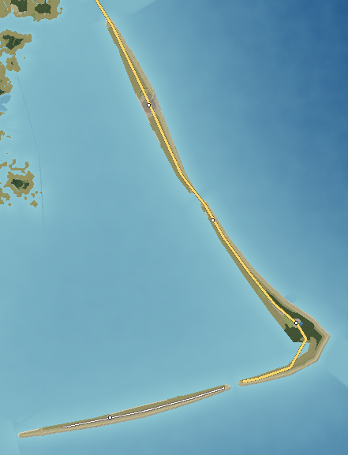

# The Gannet Banks — Barrier Islands

The Gannet Banks are three thin islands of sand, 27 km long in total and rarely more than 600 m wide, standing 5–15 km off the coast in front of the shallow lagoon of Tarrow Sound. They take the full force of the Atlantic: wide surf beaches, the biggest dunes on the coast, inlets that move, shoals that have wrecked ships, and a cape where waves from two directions collide. A lighthouse painted in a black-and-white checkerboard stands at the elbow; an offshore wind farm stands in rows on the shoals beyond.

---

## 1. Geography

**Shape and size.** A chain shaped like a bent arm: **Kestrel Island** runs south-east from Ambrose Inlet for 13 km to **Sheepshead Inlet**; **Merrin Island** continues 9 km to the elbow at **Cape Merrin**, then turns west for 3 km to **Rockfish Inlet**; **Pennick Island** runs 9 km west from there toward the Sabal Flats. Total land 34 km²; 92 km of coast. Highest point **Kestrel Hill**, a 28 m bare dune.

**Coastline.** The ocean side is one continuous beach, tan sand and crushed shell. The sound side is marsh, mudflat and oyster reef. Three inlets — Ambrose, Sheepshead and Rockfish — cut through.

**Capes and shoals.** **Cape Merrin**, a sharp cuspate cape, with **Merrin Shoals** running 15 km out to sea south-east from its tip; the **Ambrose ebb delta** off Ambrose Inlet.

**Islands offshore.** Saint Ambrose 2.4 km north across Ambrose Inlet; Ossahatchee 5 km west across Tarrow Sound; the Sabal Keys 5 km south-west.

**Dunes.** A continuous foredune 5–10 m high, the **Kestrel dune field** behind Kestrel village with the migrating Kestrel Hill, and old stabilised dune ridges under the forest at Merrin.

**Ponds and wetlands.** Merrin Woods Pond (a freshwater pond in the dune swales); salt marsh along the sound side.

**Forests.** **Merrin Woods** — maritime forest of live oak, loblolly pine and dogwood on the widest part of the cape; salt-pruned wax myrtle and yaupon thickets elsewhere.

**Beaches.** Eight: Kestrel Beach, Medano Beach, Cape Merrin Point, Lighthouse Beach, Shellbank Beach, Pennick Beach, Rockfish Spit and Inlet Point.

**Why it looks like this.** Barrier islands form where a wide, gently sloping shelf, plenty of sand and a modest tide meet. Waves build the beach; wind builds the dunes; storms wash sand across the island into the lagoon behind (the overwash fans that make the sound side so flat). Cape Merrin forms where longshore currents from the north and south converge and drop their sand; the shoals are that sand extending under water. The islands migrate slowly landward.

## 2. Geological logic

- **Character:** loose quartz and shell sand over lagoon mud; no rock.
- **Soils:** sand everywhere; thin organic layers under Merrin Woods.
- **Erosion and deposition:** the ocean beach retreats in storms and rebuilds in calm months; inlets migrate south a few metres a year; overwash builds the sound side.
- **Drainage:** none on the surface; a freshwater lens under the widest parts.
- **Flood-prone:** all of it in a hurricane surge; low sections overwash in strong nor'easters, burying the highway in sand.
- **Coastal erosion:** strongest at Cape Merrin, where an earlier lighthouse foundation now lies in the surf.

## 3. Visual identity

- **Dominant colours:** tan sand, pale grey-green dune grass, white surf, dark blue Atlantic.
- **Secondary colours:** the checkerboard of the lighthouse; the white turbines; weathered grey shingle houses.
- **Vegetation:** sea oats, beach grass, salt-pruned shrubs sheared flat by the wind; a single maritime forest.
- **Terrain silhouette:** a long, low line with one big pale dune.
- **Skyline:** Cape Merrin Lighthouse (60 m), the wind farm's 28 turbines, the Kestrel concrete tower.
- **Architecture:** shingled cottages on stilts, a few large beach houses, fish houses on pilings in Merrin harbour, a bait shack by the bridge.
- **Coastline:** surf and dunes on one side, marsh and calm water on the other — visible together from the dune crest.
- **Atmosphere:** wind, salt spray, the sound of surf everywhere.
- **Signature feature:** **Cape Merrin Lighthouse** above the collision of the waves at the cape.

## 4. Transportation geography

**Roads.** **SR 14 Banks Highway** runs the length of Kestrel and Merrin islands from the **Ambrose Inlet Bridge** (2,300 m, concrete high-rise, 20 m clearance), over the **Sheepshead Inlet Bridge** (725 m, concrete high-rise, 18 m) to Cape Merrin and Merrin harbour, then to the Rockfish Inlet ferry. On Pennick Island, **Pennick Road** (10.5 km, sand-shouldered county road) runs from the ferry landing to Pennick village. Sand tracks lead to the beach; four-wheel-drive access along the beach at Pennick.

**Bridges.** High-rise spans over the two inlets that carry boat traffic between the ocean and Tarrow Sound.

**Railroads.** None.

**Aviation.** **Merrin Airstrip** (13/31, 1,200 m paved) on the widest part of the cape behind the forest.

**Maritime.** **Merrin Harbor** (3 m, fishing boats on the sound side); the **Rockfish Inlet Ferry** (a free vehicle ferry across the inlet to Pennick); the **Tarrow Sound Ferry** from Tarrow Landing to Pennick; a marina at Kestrel on the sound side.

## 5. Settlement pattern

| Settlement | Population | Why it is here |
|---|---|---|
| Kestrel | 2,000 | The widest part of Kestrel Island, sheltered behind the big dunes. |
| Merrin | 900 | Maritime-forest village at the elbow of Cape Merrin with a sound-side harbour. |
| Pennick | 400 | Ferry-only village on the widest part of Pennick Island. |
| Shellbank | 300 | Fishing hamlet beside Sheepshead Inlet. |

Houses only where the island is wide enough to have stable ground behind the dunes; long empty stretches between.

## 6. Exploration design

- **Kestrel Hill:** a bare 28 m dune to climb, with the whole Banks and Tarrow Sound below.
- **The cape:** Cape Merrin Point at low tide, waves meeting from two sides; the old lighthouse foundation in the surf.
- **Shoals:** a steamship boiler and ribs exposed on Merrin Shoals at low tide.
- **Pennick:** reachable only by ferry; a long empty beach facing south.
- **The concrete tower:** a windowless tower alone in the dunes at Kestrel.
- **Inlets:** shifting spits, fishing from the bridge catwalks.

## 7. Visual landmark system

- **Primary:** Cape Merrin Lighthouse, the Merrin Shoals Wind Farm, the Kestrel Hill Dune.
- **Local:** the Merrin Shoals Boiler, the Kestrel Concrete Tower.
- **Micro:** the Sheepshead Bait Shack.

## 8. Atmosphere

**Weather.** Always windy. Summer sea breezes and occasional storms; autumn hurricanes and winter nor'easters bring overwash, high surf and sand across the highway. Clear, cold, blue winter days.

**Fog.** Sea fog in spring, sometimes for days, with the foghorn at the cape.

**Lighting.**
- *Sunrise:* straight out of the Atlantic — the Banks' defining moment.
- *Morning:* low sun across the dune ripples.
- *Noon:* glare off wet sand.
- *Afternoon:* the wind rises.
- *Golden hour:* the dunes and the lighthouse glow; the turbines catch the light.
- *Sunset:* across Tarrow Sound, the water mirror-flat on the sound side.
- *Blue hour:* the lighthouse beam begins; red lights blink on every turbine.
- *Night:* the turning beam, the turbine lights, stars.

**Seasons.** *Spring*: fog and wind. *Summer*: the beach season. *Autumn*: storms, fishing at the inlets. *Winter*: empty, cold and brilliant.

## 9. Environmental storytelling (physical evidence only)

- An earlier lighthouse foundation lies in the surf below the current light.
- A boiler and the iron ribs of a ship emerge from the shoals at low tide.
- A windowless concrete tower stands alone in the dunes.
- Sand fans cover sections of the road after storms; plows push it back to the shoulders.
- Dune fences and planted grass rows on new dunes.

## 10. Biome distribution

| Zone | Where | Why |
|---|---|---|
| Beach | Ocean side | Wave-built sand. |
| Dunes and dune grass | Behind the beach | Wind-built sand, salt spray. |
| Shrub thicket | Behind the dunes | Shelter from the worst spray, pruned by wind. |
| Maritime forest | Merrin Woods | The widest, oldest part of the island. |
| Salt marsh | Sound side | Overwash flats, calm water. |

## 11. Human infrastructure

- **Power:** the **Merrin Shoals Offshore Wind** farm (380 MW, 28 turbines) lands its cable at Kestrel and feeds the Kestrel Substation, which also takes a 115 kV line from Haversham.
- **Water:** wells into the freshwater lens; a water tower at Kestrel.
- **Sewage:** package treatment plants; septic fields at Pennick.
- **Navigation:** Cape Merrin Lighthouse, inlet buoys and channel markers.
- **Coastal works:** sand fencing, dune planting, a beach-renourishment pipeline at Kestrel.

## Inspiration matrix

| Category | Inspiration | Why |
|---|---|---|
| Real-world geography | The Outer Banks (NC): Cape Hatteras, Diamond Shoals, Jockey's Ridge | A barrier chain far offshore with a cape, dangerous shoals and a giant dune. |
| Architecture | Outer Banks cottages, lighthouses and fish houses | Weathered, raised, wind-resistant building. |
| Vegetation | Atlantic barrier dune and maritime forest | Spray and sand tolerance decide what grows where. |
| Atmosphere | *Fallout 4* (Far Harbor) | Wind, fog, the sound of the sea. |
| Exploration design | *Assassin's Creed IV: Black Flag* | Islands, inlets and shoals read from the water. |
| Landmark philosophy | *Assassin's Creed Odyssey* | A single tall light on a headland. |
| Environmental storytelling | *STALKER* | Unexplained structures — a tower, a wreck, a foundation in the surf. |

<!-- BEGIN GENERATED -->
### Measured from the generated terrain

| Measure | Value |
|---|---|
| Land area | 34 km² |
| Inland water | 0.1 km² |
| Sea coastline | 92 km |
| Greatest length | 26.7 km |
| Highest point | Kestrel Hill, 28 m |
| Mean elevation | 4 m |
| Land below 3 m | 35% |
| Slopes steeper than 40% | 0% |
| Population | 3,600 |
| Longest drive | Pennick – Kestrel, 32.0 km, 46 min |
| Register entries | 6 landmarks, 3 viewpoints, 8 beaches, 1 lakes, 2 forests, 1 summits, 0 districts |

**Land cover (share of land area)**

| Cover | Share | km² |
|---|---|---|
| Sand-pine and oak scrub | 41.8% | 14.3 |
| Dunes and sea oats | 32.9% | 11.2 |
| Maritime live-oak forest | 8.7% | 3.0 |
| Beach sand | 8.0% | 2.7 |
| Suburban | 3.3% | 1.1 |
| Pasture and hay | 2.2% | 0.7 |
| Urban | 1.7% | 0.6 |
| Airport | 1.0% | 0.3 |

**Settlements**

| Settlement | Form | Population | Why here |
|---|---|---|---|
| Kestrel | resort | 2,000 | Widest part of Kestrel Island, sheltered behind the big dunes. |
| Merrin | village | 900 | Maritime-forest village at the elbow of Cape Merrin with a sound-side harbor. |
| Pennick | village | 400 | Ferry-only village on the widest part of Pennick Island. |
| Shellbank | hamlet | 300 | Fishing hamlet beside Sheepshead Inlet. |
<!-- END GENERATED -->
