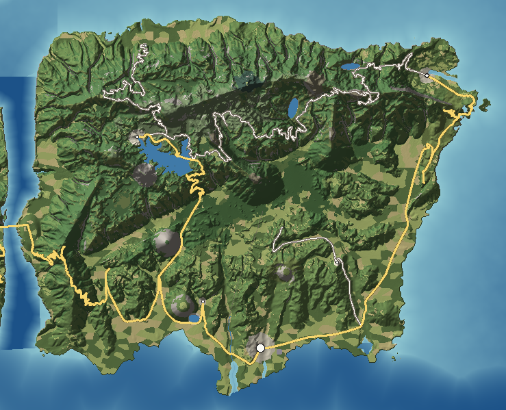

# Graystone Island — Mountainous Escarpment

Graystone is a tilted slab of granite. Its northern two-thirds are a cool, rolling highland around 1,000 m, crowned by the Whitlock Range; its southern edge breaks off in the **Blue Wall**, an escarpment that falls 800 m in two kilometres to a strip of red-clay Piedmont and the Sound. Every southerly wind is forced up that wall, so Graystone is the wettest, greenest and most waterfall-cut island in the chain. Where Halcomb is a crest of summits, Graystone is a cliff.

---

## 1. Geography

**Shape and size.** A rough square, 32 km east–west by 24 km north–south, 675 km² of land, 161 km of coast. Elevation from sea level to 1,724 m at Whitlock Mountain. Greatest length 37 km (south-west to north-east).

**Coastline.**
- *North shore* (on The Narrows): 70 m cliffs with a few creek-mouth coves; Stillhouse is the only landing.
- *East coast*: the **Fallon Cliffs**, granite sea cliffs up to 210 m, broken once by **Fallon Cove**, a deep notch with the island's best natural harbour.
- *South coast* (on Cassena Sound): low and indented — Cutstone Bay, the harbour at Graystone town, and **Graystone Head**, a 45 m granite headland with a light.
- *West coast*: the 185–230 m walls of **Hollow Reach**, with **Veil Falls** dropping 130 m into the gorge.

**Bays and coves.** Fallon Cove, Cutstone Bay, Head Cove (a pocket beach behind Graystone Head), the coves of the north shore.

**Peninsulas.** Graystone Head (south-east); the cape north of Fallon Cove with Cape Fallon Light.

**Islands offshore.** None; Halcomb lies 1.1 km across Hollow Reach and Corliss 4.8 km south across the Sound.

**Mountains and ridgelines.** The **Whitlock Range** runs along the northern edge of the highlands: Hawkbill Knob (1,310 m), Whitlock Mountain (1,724), Lantern Mountain (1,652, with a radar dome), Frostcap (1,560), Ravenrock (1,390), Fallon Knob (1,180). On the highland's south rim stand the escarpment summits — Sassafras Knob (1,480), Pale Wall Mountain (1,440, with a 230 m granite face), Bald Rock (1,260), Hornet Spire (1,210), Anvil Rock (1,120). Below the wall, the Piedmont strip carries bare granite domes: **Grayback** (455 m, rising 380 m out of farmland), **Glassface Dome** and **Cutstone Mountain**.

**Valleys.** The highland is dissected by deep valleys: the upper Thunderhole (Lake Whitlock), the Bright Water gorge, the Fallon River. The Piedmont strip is rolling, with shallow valleys running to the Sound.

**Rivers and streams.** Seven named. The **Thunderhole** (21.6 km, falling 1,186 m) crosses the highland, fills Lake Whitlock, plunges through a slot in the Blue Wall at Thunderhole Falls (120 m) and reaches the Sound at Graystone town. The **Bright Water** (19.3 km) heads in Bright Water Lake and has cut the Bright Water Gullies into the Piedmont below the wall. The **Fallon River** (9.7 km) drains east into Fallon Cove. Hollow Creek ends in Veil Falls; Stillhouse Branch and the Ravenfork are cascades that fall more than 250 m per kilometre.

**Lakes.** Lake Whitlock (5.4 km², 942 m), Bright Water Lake (behind a granite sill at the head of the gorge), Fallon Reservoir (water supply), the flooded pit of the Cutstone Quarry.

**Wetlands, marshes, swamps.** Minimal: seepage bogs on the highland, a small salt marsh in Cutstone Bay.

**Forests.** Temperate rainforest on the Blue Wall's face; old forest in the Thunderhole Gorge (too steep ever to have been cut); northern hardwoods on the highland; a relict red-spruce stand on Lantern Mountain's north side; wind-sheared oak and pine on the Fallon cliff tops; loblolly pine and oak on the Piedmont.

**Cliffs.** The Blue Wall, the Pale Wall, the Fallon Cliffs, the Hollow Reach walls, the North Shore cliffs, Graystone Head.

**Beaches.** All small: Fallon Cove (cobble and gravel, boats hauled out), Veil Falls Shingle (boat access only), Head Cove (pocket sand), Stillhouse (cobble), Cutstone Bay (coarse granite sand).

**Geological formations.** Exfoliation domes (Grayback, Glassface), weathering pits on bare granite (Bald Rock Pools), the granite prow of Anvil Rock, the Bright Water Gullies (erosion in deeply weathered saprolite), the waterfall slots in the escarpment.

**Why it looks like this.** Graystone is the same uplift as Halcomb but in more massive rock: granite and granitic gneiss that weather into domes and break in sheer joints. The block is tilted — high on the north and east, low on the south — and the southern edge has been eaten back by rivers into a steep, retreating escarpment. The highland above is an old, gentle land surface that the rivers have not yet reached, which is why its streams wander and pond (Lake Whitlock, Bright Water Lake) before suddenly plunging off the wall.

## 2. Geological logic

- **Character:** massive granite and granitic gneiss; dark gneiss on Ravenrock; the Piedmont strip is deeply weathered granite (saprolite) under red clay.
- **Soils:** thin, acid, rocky soils on the highland; deep red clay (saprolite many metres thick) on the Piedmont; organic, moss-rich soils on the escarpment face; bare rock on domes.
- **Erosion:** headward erosion of the escarpment by streams — the waterfalls are the active edge. Gullying of exposed saprolite where forest was cleared (the Bright Water Gullies). Exfoliation sheets peel off the domes.
- **Sedimentation:** coarse granite sand and cobble beaches; alluvial fans at the foot of the Blue Wall where streams leave the slope; a delta at the Thunderhole mouth.
- **Drainage:** deranged and sluggish on the highland (lakes, bogs), steep and straight on the escarpment, branching on the Piedmont.
- **Flood-prone:** the Thunderhole and Bright Water at the foot of the wall during tropical rain (water rises fast and carries boulders onto the fans); Graystone town's low harbour streets in storm surge.
- **Landslide-prone:** the Blue Wall face (debris flows after extreme rain), road cuts on the Whitlock Grade.
- **Coastal erosion:** slow — granite cliffs retreat by rockfall at the Fallon Cliffs; the Piedmont shore is sheltered.
- **Mountain and river formation:** uplift and tilting of a granite block; rivers draining south were steepened at the fault edge and have cut back into the highland ever since, each in its own slot.

## 3. Visual identity

- **Dominant colours:** pale grey granite against deep wet green.
- **Secondary colours:** the red clay of the Piedmont and gullies (red, orange, white); white water in every ravine; the white radar dome on Lantern Mountain.
- **Vegetation:** moss-hung rainforest on the wall, rhododendron everywhere, open granite glades with red cedar on the domes.
- **Terrain silhouette:** a long, level skyline (the highland) ending in an abrupt wall, with bare grey domes standing in front of it like stepping stones.
- **Skyline:** the radar dome on Lantern Mountain; Graystone Head Light and Cape Fallon Light on the coast.
- **Architecture:** granite-built harbour town with stone wharves; stone and shingle summer houses and boathouses at Whitlock; fishermen's houses stacked up the walls of Fallon Cove with tall, narrow net lofts.
- **Coastline:** sheer grey cliffs on three sides, with white water at their foot.
- **Atmosphere:** low cloud clinging to the wall; dripping, saturated green.
- **Signature feature:** **the Blue Wall** — an 800 m escarpment streaked with waterfalls, seen from the Sound or from Grayback's summit.

## 4. Transportation geography

**Highways.** Graystone has no interstate. Its main roads are state routes laid out by the escarpment:
- **SR 11 Blue Wall Road** (52.7 km): along the foot of the Blue Wall from Graystone town west to the Gate Bridge, joining the Gate Road from Halcomb. It follows the break between the Piedmont and the wall — the flattest continuous line on the island.
- **SR 64 Graystone Coast Road** (44.9 km): east from Graystone town round Graystone Head, then north along the top of the Fallon Cliffs to Fallon.
- **SR 107 Whitlock Grade** (22.4 km): the only state road up the Blue Wall, signed at 10%, with switchbacks past Glassface Dome, short viaducts across ravines, and the Whitlock Lake Bridge (a steel deck arch over the reservoir).

**County, mountain and forest roads.**
- **CR 107 Highlands Road** (68 km for 22 km as the crow flies): across the highland from Whitlock to Fallon, plunging into and climbing out of three gorges — the most winding road in the islands.
- **CR 64 Bright Water Road**: from the coast through Bright Water village up beside the gullies.
- **CR 2 Stillhouse Road**: from Whitlock down to the north shore.
- Gravel forest roads on the highland; private drives to summer houses at Whitlock.

**Bridges.** The **Gate Bridge** (shared with Halcomb) — 880 m main span, deck 249 m above Hollow Reach, crossing where shelves of equal height face each other. The **Whitlock Lake Bridge** on SR 107. Short stone-arch bridges on the Blue Wall Road over every stream issuing from the wall.

**Railroads.** No active railway: Graystone's freight goes by ferry and barge. The **Blue Wall Incline** is an unfinished railway grade that climbs from Graystone town toward the wall on embankments and stops at a 400 m stone-lined tunnel (the Blind Tunnel) that ends at a rock face. Its viaduct piers stand in the Piedmont fields.

**Aviation.** No airport (no flat ground long enough). A seasonal fire helibase at Whitlock; a rescue helipad at Fallon; the Lantern Mountain radar serves air traffic for the whole region.

**Maritime.** The **Graystone–Calder Ferry** (vehicle ferry, 16 knots, about 50 minutes on the water to Calder) from the terminal in Graystone harbour; **Fallon Harbor** (fishing boats, 6 m alongside); a granite-loading wharf at Cutstone Bay; a cobble landing at Stillhouse.

## 5. Settlement pattern

| Settlement | Population | Why it is here |
|---|---|---|
| Graystone | 21,000 | The island's one sheltered south-facing harbour, between the Thunderhole mouth and Quarry Creek: ferry terminal, granite wharves, and the only wide flat ground. |
| Fallon | 3,500 | The only cove breaking the Fallon Cliffs; fishing harbour. |
| Cutstone | 1,400 | Beside the granite quarry on Cutstone Mountain. |
| Whitlock | 1,200 | Cool summer village on the highland beside Lake Whitlock, at the top of the Grade. |
| Bright Water | 600 | Mill village where the Bright Water leaves the foot of the wall with enough fall to turn a wheel. |
| Stillhouse | 200 | Fishing hamlet at the mouth of Stillhouse Branch on the north shore. |

**Rural pattern.** Small farms on the Piedmont strip, many with gullied old fields and terraces gone back to pine; orchards on the lower slopes; highland meadows for summer grazing around Whitlock; almost no settlement on the wall itself. **Roadside business** is limited to Graystone town and a store and gas station at the foot of the Whitlock Grade. **Industry:** the Cutstone granite quarry and stoneyards at Cutstone Bay.

## 6. Exploration design

- **Mountain passes and grades:** the Whitlock Grade switchbacks; the Highlands Road's gorge crossings.
- **Scenic overlooks:** twelve registered viewpoints — Whitlock Mountain summit, the Pale Wall rim, Glassface pull-off, Grayback summit, Anvil Rock, Ravenrock Ledges, the Thunderhole Gorge overlook, the Fallon Cliffs pull-off, Cape Fallon Light, Veil Falls rim and the Gate Bridge.
- **Waterfalls:** Thunderhole Falls (120 m, in a slot), Veil Falls (130 m into salt water), and dozens of unnamed falls on the Blue Wall, each in its own ravine.
- **Trails:** a rim trail along the top of the Blue Wall; the gorge trail to the foot of Thunderhole Falls; paths over the bare domes.
- **Hidden beaches:** Veil Falls Shingle (by boat only), Head Cove, the north-shore coves.
- **Abandoned infrastructure:** the Blue Wall Incline embankments, piers and the Blind Tunnel.
- **Unusual formations:** weathering-pit pools on Bald Rock; the Anvil Rock prow; the Bright Water Gullies, a small red badland.
- **Remote places:** Stillhouse and its spring ruins; the Frostcap heath bald.
- **Offshore view:** from the Fallon Cliffs, the Atlantic and the far line of the Gannet Banks lighthouses on a clear day.

## 7. Visual landmark system

- **Primary:** the Gate Bridge, Grayback Mountain (bare dome), the Lantern Mountain Radar Dome, the Blue Wall, the Fallon Cliffs.
- **Secondary:** Veil Falls, Thunderhole Falls, Cape Fallon Light, the Cutstone Quarry benches, Graystone Head Light, Lake Whitlock Dam, the Bright Water Gullies.
- **Local:** the Blind Tunnel portal.
- **Micro:** the Stillhouse Branch ruins, Kudzu House, the Bald Rock Pools, the Fallon net lofts.

## 8. Atmosphere

**Weather.** The wettest island: about 2,500 mm a year on the face of the wall. Orographic cloud forms on the wall on most summer afternoons even when the Sound is clear; long soaking rains in tropical systems turn every ravine white. Winter brings rime and snow to the highland and the Whitlock Range while the Piedmont stays green. Spring brings drizzle and low cloud for days.

**Fog.** Upslope fog and cloud on the Blue Wall; radiation fog in the Thunderhole and Bright Water valleys; sea fog over The Narrows reaching the north shore; mist over Lake Whitlock at dawn.

**Lighting.**
- *Sunrise:* hits the Fallon Cliffs first, turning them gold above the dark sea.
- *Morning:* the wall faces south-east and is lit in the morning — its waterfalls glitter.
- *Noon:* the domes glare white.
- *Afternoon:* cloud builds on the wall and shadows it.
- *Golden hour:* Grayback's bare granite turns pink and orange.
- *Sunset:* from the Gate Bridge, straight down Hollow Reach into the west.
- *Blue hour:* the wall goes dark; the radar dome's beacon blinks above.
- *Night:* almost no lights on the highland; Graystone town's harbour and the ferry's lights below the wall.

**Seasons.** *Spring*: waterfalls at full flow, trillium and dogwood in the coves. *Summer*: dense green, cloud and storm, rhododendron in June. *Autumn*: the highland turns red and gold two weeks before the Piedmont. *Winter*: ice on the wall's waterfalls, snow on the range.

## 9. Environmental storytelling (physical evidence only)

- A railway embankment and line of viaduct piers cross Piedmont fields toward the wall and end at a stone tunnel portal; inside, 400 m on, a blank rock face.
- A farmhouse has vanished under kudzu; only the roofline shape remains.
- Red gullies 40 m deep have opened in old fields; fence posts stand in mid-air on their edges.
- Granite derricks rust above the flooded lower pit at Cutstone.
- A rock-walled pit, copper scraps and barrel staves sit beside a spring in a hidden ravine at Stillhouse.
- Old farm terraces run across slopes now covered in pine.

## 10. Biome distribution

| Zone | Where | Why |
|---|---|---|
| Temperate rainforest (cove hardwood, hemlock, rhododendron) | The Blue Wall face and every ravine | Highest rainfall in the islands and permanent shade. |
| Northern hardwoods | Highland surface above about 1,000 m | Cool and cloudy. |
| Spruce | North side of Lantern Mountain | Coldest, cloudiest slope. |
| Heath bald | Frostcap summit | Frost-exposed thin soil. |
| Oak–hickory and granite glades | Domes, cliff tops, dry ridges | Bare rock and thin soil. |
| Pine–hardwood and loblolly | Piedmont strip | Old fields on red clay. |
| Pasture and hay | Piedmont strip, highland meadows near Whitlock | The only gentle, cleared ground. |
| Bare rock | Domes, the Pale Wall, cliffs | Massive granite. |

## 11. Human infrastructure

- **Power:** a 115 kV line arrives from Halcomb over the Hollow Reach Power Span and runs along the Blue Wall Road to the Graystone Substation behind the town.
- **Water:** Fallon Reservoir supplies Fallon; Graystone town draws from the lower Thunderhole; Lake Whitlock's dam is a stone-faced wall with a stepped spillway.
- **Communications:** the Lantern Mountain air-traffic radar dome and its lit tower; a cell tower on Grayback's shoulder.
- **Quarry:** the Cutstone Granite Quarry — terraced benches, a flooded pit, derricks, and a stoneyard at the wharf.
- **Fuel and freight:** a fuel dock at Fallon Harbor; ferry marshalling lanes and a small truck yard at Graystone.
- **Sewage:** a small treatment plant east of Graystone town discharging to the Sound.
- **Construction:** rock-fall netting and fresh anchors on the Whitlock Grade road cuts.

## Inspiration matrix

| Category | Inspiration | Why |
|---|---|---|
| Real-world geography | Blue Ridge Escarpment and the Highlands–Cashiers plateau (NC/SC/GA); Stone Mountain and the granite domes of Georgia and the Carolinas | A south-facing escarpment with very high rainfall and waterfalls on its face, with granite monadnocks on the Piedmont below. |
| Architecture | Granite-built harbour towns of the Atlantic coast; mountain summer colonies of the Blue Ridge | A stone harbour town from its own quarry and a cool-weather resort on the highland. |
| Vegetation | Southern Appalachian temperate rainforest (the escarpment gorges); granite outcrop communities | The wettest slopes carry the richest, mossiest forest; the domes carry outcrop specialists. |
| Atmosphere | *Ghost of Tsushima* | Wind-driven cloud on a mountain wall and strong colour in autumn. |
| Exploration design | *Elden Ring* | A plateau hidden behind a wall, seen first from below; waterfalls that point to the way up. |
| Landmark philosophy | *Assassin's Creed Valhalla* | Fjord-like drowned gorge, cliffs and a bridge high over the water. |
| Environmental storytelling | *Fallout: New Vegas* | Unfinished infrastructure (a tunnel that goes nowhere) shown without comment. |

<!-- BEGIN GENERATED -->
### Measured from the generated terrain

| Measure | Value |
|---|---|
| Land area | 675 km² |
| Inland water | 7.2 km² |
| Sea coastline | 161 km |
| Greatest length | 37.2 km |
| Highest point | Whitlock Mountain, 1,724 m |
| Mean elevation | 439 m |
| Land below 3 m | 0% |
| Slopes steeper than 40% | 30% |
| Population | 27,900 |
| Longest drive | Fallon – Stillhouse, 92.3 km, 2 h 06 min |
| Register entries | 17 landmarks, 12 viewpoints, 5 beaches, 4 lakes, 10 forests, 17 summits, 2 districts |

**Land cover (share of land area)**

| Cover | Share | km² |
|---|---|---|
| Pine–hardwood forest | 35.7% | 241.3 |
| Cove hardwood and rhododendron | 30.0% | 202.3 |
| Pasture and hay | 10.2% | 68.8 |
| Oak–hickory forest | 9.5% | 63.9 |
| Cropland | 5.1% | 34.5 |
| Northern hardwoods | 4.0% | 26.7 |
| Bare rock and cliff | 3.8% | 25.4 |
| Suburban | 0.8% | 5.3 |

**Settlements**

| Settlement | Form | Population | Why here |
|---|---|---|---|
| Graystone | town | 21,000 | Ferry and quarry town on the island's one sheltered south-facing harbor, between the Thunderhole mouth and Quarry Creek. |
| Fallon | town | 3,500 | Harbor in the only cove breaking the Fallon Cliffs; fishing boats and a rescue-boat station. |
| Cutstone | village | 1,400 | Quarry village beside the granite pit on Cutstone Mountain. |
| Whitlock | resort | 1,200 | Summer village on the cool highland plateau beside Lake Whitlock, 1,050 m above the sound. |
| Bright Water | village | 600 | Mill village where the Bright Water River leaves the foot of the Blue Wall and its fall can turn a wheel. |
| Stillhouse | hamlet | 200 | Fishing hamlet at the mouth of Stillhouse Branch on the north shore. |

**Rivers**

| River | Length | Fall | Gradient |
|---|---|---|---|
| Thunderhole River | 21.6 km | 1,186 m | 54.9 m/km |
| Bright Water River | 19.3 km | 1,021 m | 52.9 m/km |
| Fallon River | 9.7 km | 923 m | 95.2 m/km |
| Quarry Creek | 7.3 km | 122 m | 16.7 m/km |
| Hollow Creek | 5.4 km | 898 m | 166.4 m/km |
| Stillhouse Branch | 4.2 km | 1,072 m | 255.3 m/km |
| Ravenfork | 3.0 km | 934 m | 316.5 m/km |
<!-- END GENERATED -->
