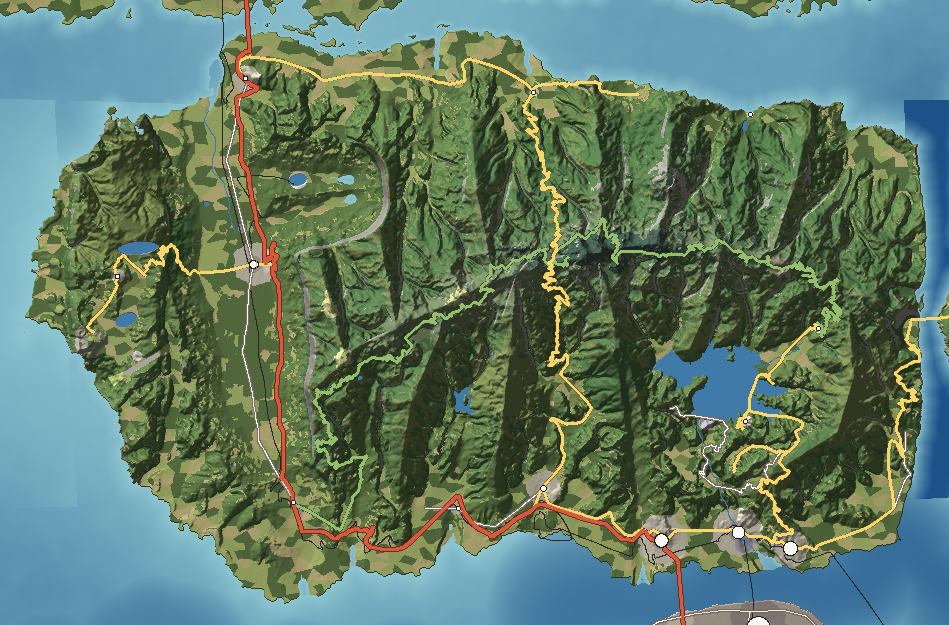

# Halcomb Island — Appalachian Highland

Halcomb is the high island: a 45 km block of old crystalline mountains whose crest stands 2,047 m above the sea. Its north side falls almost straight into The Narrows; its south side unrolls in long spurs and deep coves toward Cassena Sound and the city. A limestone valley and a sandstone tableland on its western flank make it a compressed version of the whole southern Appalachian sequence — high crest, long valley, flat-topped plateau — in one island.

---

## 1. Geography

**Shape and size.** A broad, blunt rectangle 44 km east–west and 24 km north–south, with a western lobe (the Hickory Tableland) and a south-western lobe (Shady Point). Land area 978 km²; greatest length 45 km; elevation from sea level to 2,047 m at Ledford Dome; 181 km of sea coast.

**Coastline.** Three coasts with three characters:
- *The North Face coast* along The Narrows is steep and almost harbourless: wooded slopes and 20–30 m slate bluffs drop into cold, fast water. Small cobble coves sit only where creeks reach the sea (Pigeonroost, Callahan, Big Laurel). The road ends at Callahan Landing; beyond it the cliffs run unbroken to Big Laurel.
- *The south coast* along Cassena Sound is gentler: foothill ridges, the North Channel facing Calder, the Tennalee estuary, Hominy Bay (the only sheltered anchorage in the south-west), Shady Point and Dogwood Point.
- *The west coast* below the Hickory Tableland is a 95 m sandstone cliff line, broken only at Piney Cove where Piney Creek falls straight onto the beach.
- *The east coast* is the wall of Hollow Reach, a 0.75–2.8 km drowned gorge separating Halcomb from Graystone.

**Bays, coves and peninsulas.** Hominy Bay (south-west), the North Channel and Tennalee mouth (south), Dogwood Point (south-east), Shady Point (south-west lobe), Lookout Bluff (the sandstone promontory on the west coast), Piney Cove (west), and the creek-mouth coves of the north coast.

**Islands offshore.** None of its own: the nearest land is Calder, 1.5 km across the North Channel, the mainland 0.6 km across The Narrows at the bridge, and Graystone across Hollow Reach.

**Mountains and ridgelines.** The **Balsam Crest** runs east–west for 30 km through Gooseberry Bald (1,420 m), Stormhead (1,640), Painted Bald (1,745), Coldspring Knob (1,905), Ledford Dome (2,047), Mount Sawyer (1,985), Hemlock Knob (1,872) and The Steeples (1,620) before dropping to Bearpen Knob (1,320) above Hollow Reach. Twelve spurs leave it: short, steep ones north (Rich, Thunderstone, Blackstrap, Callahan, Big Laurel) and longer ones south (Sugartree, Brushy, Cove, Huckleberry, Dogwood) that end in foothill knobs above the Sound. Mount Callahan (1,955 m) stands on a north spur and owns the **Callahan North Face**, a 1,900 m slope from salt water to summit.

**Valleys.** The **Coldwater Valley** — a 20 km limestone trough between the crest and the tableland, floored at 5–70 m, carrying the Coldwater River north to The Narrows. **Tennalee Cove** — a bowl-shaped interior basin enclosed by the crest and its spurs, now flooded by Calloway Lake. The **Lower Tennalee Gorge** below the dam. Narrow V-valleys on every spur: Ledford Prong, Hominy Creek, Little River, Pigeonroost.

**Rivers and streams.** Sixteen named streams. The Tennalee (19.8 km, falling 1,156 m) is the largest; the Coldwater (20.4 km) is the gentlest. The North Face streams fall 130–200 m per kilometre in continuous cascades.

**Lakes and ponds.** Calloway Lake (13.7 km² reservoir), Lake Hominy (water supply), Hickory Lake on the tableland, Sinking Pond (a karst pond that drains through its floor each summer), the Blue Hole (a spring pool), the flooded Coldwater Quarry, Gooseberry Pond (a mountain bog) and Big Laurel Millpond.

**Wetlands.** Small and specific: the sphagnum bog of Gooseberry Pond in a saddle on the western crest; spring-fed sedge meadows on the Coldwater Valley floor; salt marsh at the Tennalee and Coldwater estuaries.

**Forests.** Almost everything above the valley floors: cove hardwood and rhododendron in the hollows, oak–hickory on dry ridges, northern hardwoods from about 1,400 m and spruce–fir on the summits above about 1,850 m.

**Cliffs.** The North Face cliffs on Mount Callahan, the North Face Bluffs along The Narrows, the Tableland Bluffs, the walls of Hollow Reach and the twin slate spires of The Steeples.

**Beaches.** Few, and mostly cobble: Pigeonroost and Piney Cove (cobble), Hominy Bay Beach (coarse quartz sand), Shady Point Beach (mixed), and a trucked-in sand beach on Calloway Lake.

**Geological formations.** The Steeples (paired slate pinnacles), Lookout Bluff (sandstone prow), the Blue Hole and Sinking Pond (karst), the Hogback (a quartzite ridge), the Hickory Falls rock shelter (soft shale eroded beneath sandstone), and the grassy and heath balds on the western crest.

**Why it looks like this.** The crest is the most resistant rock in the islands and the island is a tilted fault block — lifted along its northern edge at The Narrows, so the highest peaks crowd the north coast and the long, gentle slopes face south. Streams on the short northern side are steep and straight; streams on the long southern side have had room to carve coves. The western flank is softer sedimentary rock wrapped around the crystalline core, and erosion has stripped it into a valley (limestone) and a plateau (sandstone over limestone).

## 2. Geological logic

- **Character:** a crystalline core of gneiss and mica schist, with slate and phyllite along the north edge and a thin quartzite band (the Hogback) on the south. Granite ledges at the fall line. The western flank is flat-lying limestone and shale capped by sandstone.
- **Soils:** thin, rocky, acid soils on ridges; deep, dark, humus-rich colluvium in the coves (why cove forests are so tall); red clay saprolite in the southern foothills (exposed in road cuts); fertile limestone loam on the Coldwater Valley floor; thin sandy soils on the tableland.
- **Erosion:** stream incision dominates; debris slides scar the steep North Face after tropical downpours, leaving pale stripes of bare rock that take decades to green over. Freeze–thaw shatters slate on the high north face into scree.
- **Sedimentation:** gravel bars in every stream below a gradient break; deltaic mud at the Tennalee mouth; a shallow sandy delta at Pigeonroost.
- **Drainage:** a trellis pattern on the west (the Coldwater runs along the limestone strike, fed by side streams off the crest), a radial pattern off the crest elsewhere. Karst drainage on the valley floor and tableland: springs, sinks and the seasonal Sinking Pond.
- **Flood-prone areas:** the Coldwater floodplain (spring floods backing up into karst sinks), the Tennalee Falls mill district on the river below the dam, and the low terraces at Riverside during storm surge in the Sound.
- **Landslide-prone areas:** the North Face, the Pigeonroost valley under the Gap Road, and red-clay road cuts on the southern foothills.
- **Coastal erosion:** the North Face Bluffs slump into The Narrows; the south coast is sheltered and stable.
- **River and mountain formation:** uplift along the Narrows fault; rivers that were already flowing south held their courses as the land rose, cutting gorges through the harder bands (the Lower Tennalee Gorge through the quartzite). Where the rivers cross from crystalline rock onto the soft coastal sediment of the Sound, they drop over ledges — the fall line at Tennalee Falls.

## 3. Visual identity

- **Dominant colours:** deep blue-green forest under blue haze; near-black spruce–fir on the summits.
- **Secondary colours:** pale grey slate on the North Face; rust and gold in October; red clay in road cuts; the white of Calloway Dam; tin roofs on valley farms.
- **Vegetation:** layered hardwood canopy, rhododendron "hells" in the stream bottoms, grass balds on the western crest.
- **Terrain silhouette:** a long, saw-toothed crest with a dark dome at its centre (Ledford Dome with its pale tower), the twin points of The Steeples at the east end, and a flat-topped plateau to the west. Seen from the south, ridge after ridge fades into blue.
- **Skyline:** natural — summits, the Ledford Dome tower, the Gooseberry fire tower, the Coldspring Knob relay towers.
- **Architecture:** white farmhouses and tall, narrow log tobacco barns in the Coldwater Valley; five-storey brick mills and a chimney at Tennalee Falls; motels, pancake houses and an observation needle along the Ledford strip; stone Parkway overlooks with low walls.
- **Coastline appearance:** wooded slopes to the water's edge, cobble coves, grey bluffs; no sandy coast except Hominy Bay.
- **Atmosphere:** blue haze in summer, cloud caps on the crest, valley fog at dawn.
- **Signature feature:** the Callahan North Face — the full 1,900 m height of a mountain rising directly from the sea, seen from the Narrows Bridge.

## 4. Transportation geography

**Highways.**
- **I-21** (interstate, 4 lanes): 56 km on Halcomb. From the Narrows Bridge it runs south down the flat Coldwater Valley — the obvious corridor — then threads **Shady Gap**, the only low saddle (70 m) through the crest's western spurs, and runs east along the foothills of the south coast to the Tennalee River Bridge. Maximum grade 5%, no tunnels, deepest cut 16 m.
- **Balsam Crest Parkway** (93.7 km, 8% maximum): a scenic, low-speed, two-lane road along the crest from Shady Gap to Sawyer Gap and down to Upper Cove, with stone overlooks and short viaducts where it crosses steep hollows. Closed in ice storms.

**State and county roads.**
- **SR 73 Gap Road** (50 km): up Ledford Prong from Ledford to Ledford Gap and down Pigeonroost Creek to The Narrows. The only road across the crest; it needs a 3.1 km viaduct on the Pigeonroost side where the valley falls faster than the road can descend.
- **SR 28 Cove Road** (39 km): Tennalee Falls → Lower Tennalee Gorge → Calloway → round the east arm of the lake to Upper Cove, crossing Calloway Lake on the 1.85 km Calloway Lake Bridge and the 1.5 km East Arm Bridge.
- **SR 26 Gate Road** (21 km): from Dogwood Point up the spurs to the 1.65 km Bearpen Tunnel, then a 1.6 km curving viaduct down onto the Gate Shelf and the Gate Bridge to Graystone.
- **SR 2 Narrows Road** (26 km): along the north coast from Narrows Landing to Callahan Landing, where the North Face cliffs end it.
- **SR 30 Tableland Road** (19 km): from Coldwater up switchbacks through the Tableland Bluffs to Hickory Flat and Lookout Bluff.
- **SR 8 South Shore Road** (21 km): the commercial corridor of the south coast, Ledford → Halcomb Heights → Tennalee Falls → Riverside → Dogwood Point.
- **County roads:** Old Valley Road (the pre-interstate valley road, with the covered bridge), Hominy Road, Calloway Dam Road (along the dam crest), Dogwood Point Road, Ledford Dome Road (summit spur).
- **Forest, dirt and private roads:** gated gravel forest roads climb most southern coves; fire roads reach the Gooseberry fire tower; dirt farm roads cross the Coldwater pastures; private drives lead to cabins in Upper Cove and on the tableland.

**Bridges.**
| Bridge | Carries | Length | Type | Why it exists |
|---|---|---|---|---|
| Narrows Bridge | I-21 | 1,250 m, 41 m clearance | Steel cantilever truss | The narrowest point of The Narrows, where the Coldwater Valley meets the strait. |
| Narrows Rail Bridge | Main line | about 2,000 m | Through truss with swing span | Crosses a little west where the approaches stay within 2.2% grade. |
| Tennalee River Bridge | I-21 | 2,100 m, 24 m clearance | Concrete segmental box girder | Spans the Tennalee mouth and North Channel to reach Calder. |
| Market Street Bridge | Calder passenger branch | 1,400 m | Double-deck vertical lift | Brings trains from Riverside into downtown Calder; lifts for river barges. |
| Corliss Lift Bridge | Corliss freight line | 5.2 km trestle | Trestle with 46 m vertical lift span | A low freight trestle across the Sound from Tennalee Junction to Corliss, lifting for ships in the channel. |
| Gate Bridge | Gate Road | 880 m main span, deck 249 m above Hollow Reach | Steel suspension | The only point where Hollow Reach narrows to under a kilometre with shelves of equal height on both rims. |
| Calloway Lake Bridge / East Arm Bridge | Cove Road | 1.85 km / 1.5 km | Low concrete trestles | Carry the road across the reservoir's arms at 4 m above full pool. |
| Coldwater Covered Bridge | Old Valley Road | short | Red timber covered bridge | The old valley road's crossing of the Coldwater. |

**Railroads.**
- **Mainland Main Line** (97 km, 2.2% ruling grade): freight and passenger, from the Narrows Rail Bridge down the Coldwater Valley, through Shady Gap and along the south coast to **Tennalee Junction**, the yard where the freight line to Corliss leaves. A siding and team track at Shady Gap. A quarry spur serves the Coldwater Limestone Quarry.
- **Calder Passenger Branch** (4.5 km) from the junction over the Market Street Bridge to Station Square.
- **Corliss Freight Line** (20 km) from Tennalee Junction over the Corliss Lift Bridge.
- **Big Laurel Incline** (abandoned): a straight cable incline up the North Face spur above Big Laurel; the cleared swath is still visible from the water.

**Aviation.** **Hickory Tableland Airport** — a single 1,800 m runway (06/24) at 401 m on the level tableland, the only flat ground on the island long enough. A gravel helipad beside the Ledford Dome summit lot serves rescues on the crest.

**Maritime.** Riverside Barge Terminal (river barges at the Tennalee mouth), Calloway Marina (lake), small-boat landings at Big Laurel and Pigeonroost, a public ramp at Hominy Bay, and the Old Narrows Ferry Slip, a concrete ramp below the bridge.

## 5. Settlement pattern

| Settlement | Population | Why it is here |
|---|---|---|
| Riverside | 31,000 | Low terrace on the east bank of the Tennalee mouth facing downtown Calder; barge wharves and the rail junction. |
| Halcomb Heights | 28,000 | Well-drained foothill ridges above the North Channel, minutes from Calder across the Tennalee River Bridge — the city's suburbs spilling north. |
| Tennalee Falls | 24,000 | The fall line: head of navigation, water power from the ledges, the narrowest point for river crossings. |
| Coldwater | 9,000 | Centre of the limestone farm valley where the valley road, railway and tableland road meet. |
| Ledford | 4,200 | Where the Gap Road leaves the foothills for the crest: motels and outfitters for the mountains. |
| Narrows Landing | 2,600 | The bridgehead on the Narrows. |
| Hickory Flat | 2,400 | Plateau-top crossroads, flat enough for an airport. |
| Hominy | 1,500 | Head of Hominy Bay, the sheltered south-west anchorage. |
| Shady Gap | 1,100 | The saddle used by the interstate and the railway: truck plaza and siding. |
| Calloway | 900 | A bench on the cove rim at the dam's east end; marina village. |
| Pigeonroost | 300 | Where the Gap Road reaches The Narrows. |
| Upper Cove | 250 | Farm hamlet on the flat floor of the upper cove, above full pool. |
| Big Laurel | 180 | The only landing on the North Face; boat and foot access only. |

**Rural pattern.** Valley farms every few hundred metres along the Coldwater (pasture, hay, tobacco barns); cove farms at the head of every southern hollow, each with a house, a barn and a cleared bottom; scattered cabins on gravel roads; almost nobody above 1,000 m. **Roadside business** clusters at Shady Gap (truck plaza), the Ledford strip and the I-21 interchanges. **Industry** sits along the river at Tennalee Falls and at Tennalee Junction. The **commercial corridor** is SR 8 between Ledford and Riverside.

## 6. Exploration design

- **Passes:** Ledford Gap (where the Gap Road and Parkway meet at a stone overlook), Sawyer Gap (the Parkway's eastern end), Shady Gap.
- **Scenic overlooks:** fourteen registered viewpoints, from the summit tower to the Narrows Bridge crest.
- **Hidden and old roads:** the abandoned switchbacks of the old Gap Road below the modern viaduct; gated forest roads up every southern cove; the grassed-over roadbeds that run into Calloway Lake and reappear at drawdown.
- **Trails:** a crest trail along the whole Balsam Crest; a footpath from Callahan Landing along the incline to Big Laurel; the Gooseberry Pond boardwalk; the plateau-rim path from Hickory Falls to Lookout Bluff.
- **Shortcuts:** Calloway Dam Road across the dam crest; the Old Valley Road beside I-21.
- **Tunnels:** the Bearpen Tunnel, opening straight onto the Gate Bridge.
- **Caves and shelters:** the rock shelter behind Hickory Falls; small solution caves around the Blue Hole.
- **Hidden beaches:** Piney Cove under the Tableland Bluffs, reached by a steep path; Big Laurel's cobble beach.
- **Remote cabins and isolated farms:** Upper Cove; the meadow on Rich Mountain with its lone chimney; tableland farms north of Hickory Flat.
- **Waterfalls:** Hickory Falls (80 m free fall), Piney Falls (85 m onto the beach), Tennalee Falls (ledges in town), and unnamed cascades on every North Face stream.
- **Unusual formations:** The Steeples, Lookout Bluff, Sinking Pond (a lake one season and a meadow the next), the Blue Hole.
- **Abandoned industry and railways:** the Big Laurel Incline with its cable drum and a Shay locomotive on its side; Ledford Gap hotel foundations; old pits beside the working quarry.
- **Old bridges:** the Coldwater Covered Bridge; the collapsed truss of Old Hominy Bridge.
- **Natural viewpoints:** Painted Bald and Gooseberry Bald, open grassy summits with views in all directions.

The landscape does the inviting: every southern spur ends in a knob that hides the next cove; the Parkway disappears round shoulders of the crest; the North Face streams are heard before they are seen.

## 7. Visual landmark system

- **Primary** (visible across islands): Ledford Dome Tower (seen from 35% of all land), the Callahan North Face, Calloway Dam, the Narrows Bridge, the Narrows Crossing Towers (150 m).
- **Secondary** (visible across a region): Hickory Falls, Piney Falls, Tennalee Falls, the Gooseberry Fire Tower, the Coldwater Limestone Quarry's white benches, the Ledford Observation Tower and Tramway, the Hollow Reach Power Span.
- **Local:** the Bearpen Tunnel portal, the Big Laurel Shay, the Drowned Mill Chimney, Ledford Gap Foundations, the Old Narrows Ferry Slip, the Coldwater Covered Bridge, Old Hominy Bridge, the Calloway Houseboats, the Coldwater Tobacco Barns.
- **Micro:** the Rich Mountain Chimney, the Rich Creek Car Bank, the Sugartree Sugar Shack, the Gooseberry Boardwalk, the Hickory Falls Rock Shelter, the Blue Hole Rope Swing.

## 8. Atmosphere

**Weather.** Clear, cold days behind winter fronts with 60 km visibility; summer haze that turns every ridge a paler blue; afternoon thunderstorms that build over the crest by early afternoon and drift south over the Sound; rain for days when a tropical system stalls against the mountains (with flash floods in the Pigeonroost and debris slides on the North Face); rime ice and snow above 1,400 m in winter, with the Parkway closed and the spruce frosted white while the valleys are green.

**Fog.** Radiation fog fills the Coldwater Valley and the Lower Tennalee Gorge on calm nights and burns off by mid-morning; a cloud cap sits on the crest on about a third of days; sea fog from The Narrows creeps up the Pigeonroost valley in spring; mist rises off Calloway Lake on cold autumn mornings.

**Lighting.**
- *Sunrise:* from Ledford Dome, the sun comes up over Graystone and lights the fog in the cove below.
- *Morning:* low light picks out the spurs one behind the other; the valley floors are still in fog.
- *Noon:* flat and hazy in summer; hard, clear and blue in winter.
- *Afternoon:* cumulus shadows drift across the slopes; storms darken the crest.
- *Golden hour:* the south-facing spurs glow; in summer the low north-west sun rakes across the Callahan North Face.
- *Sunset:* from Lookout Bluff, straight down the Tableland Bluffs into Serena Bay.
- *Blue hour:* ridges stack in five or six layers of fading blue.
- *Night:* the lights of Calder spread below the south slopes; the Narrows Bridge is a lit arch to the north; the summit is dark.

**Seasons.** *Spring* climbs the mountains from March (redbud and dogwood in the valleys) to June (rhododendron and flame azalea on the balds). *Summer* is deep green and humid. *Autumn* colour starts on the crest in early October and reaches the valleys by November; the northern hardwoods turn yellow, the oaks red-brown. *Winter* strips the hardwoods and exposes stone walls, chimneys and old roadbeds hidden all summer; the summits are white.

## 9. Environmental storytelling (physical evidence only)

- A stone mill chimney stands in the mud of Calloway Lake when the water is drawn down in autumn, with old roadbeds running into the lake around it.
- Stone foundations and a chimney base lie in the grass at Ledford Gap.
- A concrete ferry ramp and rotting dolphins sit in the water directly beneath the Narrows Bridge.
- A steel truss lies collapsed in Hominy Creek beside a concrete bridge.
- A straight, overgrown swath climbs the North Face spur above Big Laurel; at its head a cable drum and a geared locomotive lie on their side.
- Fieldstone chimneys stand alone in mountain meadows; rusted kettles sit on a stone foundation in a sugar-maple grove.
- A row of car bodies lines an eroding bank of Rich Creek.
- Grey dead hemlocks stand over young rhododendron in the Hemlock Ghost Forest.
- Five-storey brick mills along the river at Tennalee Falls, some with windows bricked up, one with a new glass storey on top.

## 10. Biome distribution

Elevation and aspect drive almost everything:

| Zone | Where | Why |
|---|---|---|
| Spruce–fir | Summits above about 1,850 m (lower on north slopes) | Cold enough (mean annual about 7 °C) for a relict boreal forest. |
| Northern hardwoods and beech gaps | 1,400–1,850 m on the crest | Cool, cloudy, ice-storm-prone. |
| Grassy and heath balds | Gooseberry, Painted, Sheepback balds; Huckleberry Knob | Thin soil on exposed western summits. |
| Cove hardwood and rhododendron | Concave, north-facing hollows below 1,400 m | Deep moist soil and shade; the tallest trees in the islands. |
| Oak–hickory | Convex, south-facing ridges and the tableland | Dry, thin soil, full sun. |
| Pine–hardwood | Lower foothills | Warmer and drier, with old field succession. |
| Pasture, hay, cropland, tobacco | Coldwater Valley floor and cove bottoms under about 9% slope | The only fertile, flat ground. |
| Bog | Gooseberry Pond | Water held in a saddle on impermeable rock. |
| Salt marsh | Tennalee and Coldwater estuaries | Sheltered tidal flats. |
| Suburban and urban | Halcomb Heights, Riverside, Tennalee Falls | Next to the city across the North Channel. |

The measured shares are in the table at the end of this profile.

## 11. Human infrastructure

- **Power:** the Calloway Dam powerhouse (180 MW hydro) feeds the Tennalee Falls Substation by a 230 kV line down the gorge; the 500 kV line from the mainland crosses The Narrows on the 150 m Narrows Crossing Towers, steps down at the Narrows Substation and follows a cleared swath down the Coldwater Valley beside I-21. A 115 kV line crosses Hollow Reach on the Hollow Reach Power Span to Graystone.
- **Water:** Tennalee Water Works takes river water above the falls; Lake Hominy supplies Ledford and Hominy; standpipe water towers on Falls Hill, at Coldwater and at Hickory Flat.
- **Sewage:** treatment plants below Tennalee Falls and at Coldwater (small package plants serve Ledford and Narrows Landing).
- **Communications:** the Coldspring Knob relay towers (60 m) on the crest; cell towers on foothill knobs along I-21.
- **Fuel and freight:** truck plaza and fuel stops at Shady Gap; gas stations along the Ledford strip; warehouses at Tennalee Junction.
- **Quarries:** the Coldwater Limestone Quarry (working, with crushers, conveyors and a rail spur).
- **Utility corridors:** the 500 kV swath down the Coldwater Valley; the 230 kV line beside the Lower Tennalee Gorge.
- **Construction:** a widening of I-21 through Shady Gap with fresh rock cuts and orange barrels.

## Inspiration matrix

| Category | Inspiration | Why |
|---|---|---|
| Real-world geography | Great Smoky Mountains and Blue Ridge (NC/TN); Cumberland Plateau (TN); Valley and Ridge (TN) | The crest, coves and balds come from the Smokies; the tableland's caprock, bluffs and falls from the Cumberland Plateau; the farm valley from the limestone valleys of east Tennessee. |
| Architecture | Southern Appalachian farmsteads and tobacco barns; Piedmont textile-mill towns; mountain gateway tourist strips | Each building type sits where its real counterpart would: barns in the valley, mills at the fall line, motels at the foot of the pass. |
| Vegetation | Smokies cove hardwoods and spruce–fir; Cumberland oak–pine | Elevation- and aspect-driven zonation exactly as in the southern Appalachians. |
| Atmosphere | *Red Dead Redemption 2* | Haze, fog and light filtering through layered forest. |
| Exploration design | *Death Stranding* | The route is the puzzle: the crest allows one road over it and that road needs a viaduct. |
| Landmark philosophy | *Skyrim* | One summit (Ledford Dome) works as a compass for the whole island chain. |
| Environmental storytelling | *Kingdom Come: Deliverance*; *Metro Exodus* | A worked landscape — farms, mills, quarries, logging — and the decay of its railways, shown without explanation. |

<!-- BEGIN GENERATED -->
### Measured from the generated terrain

| Measure | Value |
|---|---|
| Land area | 978 km² |
| Inland water | 17.4 km² |
| Sea coastline | 181 km |
| Greatest length | 45.2 km |
| Highest point | Ledford Dome, 2,047 m |
| Mean elevation | 465 m |
| Land below 3 m | 0% |
| Slopes steeper than 40% | 31% |
| Population | 105,430 |
| Longest drive | Upper Cove – Pigeonroost, 92.3 km, 1 h 23 min |
| Register entries | 27 landmarks, 14 viewpoints, 5 beaches, 8 lakes, 13 forests, 26 summits, 7 districts |

**Land cover (share of land area)**

| Cover | Share | km² |
|---|---|---|
| Pine–hardwood forest | 39.0% | 381.6 |
| Cove hardwood and rhododendron | 22.7% | 222.4 |
| Oak–hickory forest | 12.5% | 122.0 |
| Pasture and hay | 10.1% | 98.6 |
| Cropland | 4.9% | 47.7 |
| Northern hardwoods | 3.6% | 35.0 |
| Bare rock and cliff | 3.5% | 33.9 |
| Suburban | 1.8% | 18.0 |
| Spruce–fir | 0.9% | 8.3 |

**Settlements**

| Settlement | Form | Population | Why here |
|---|---|---|---|
| Riverside | suburb | 31,000 | Low terrace on the east bank of the Tennalee mouth facing downtown Calder; barge wharves, a rail junction and a ferry slip. |
| Halcomb Heights | suburb | 28,000 | Dry, well-drained foothill ridges above the North Channel within a short drive of downtown across the Tennalee River Bridge. |
| Tennalee Falls | town | 24,000 | Fall-line town where the Tennalee drops over granite ledges into tidewater: the head of navigation, a mill race, and the narrowest point for the river crossings. |
| Coldwater | town | 9,000 | County seat in the middle of the limestone Coldwater Valley at the junction of the valley road, the railroad and the plateau road. |
| Ledford | resort | 4,200 | Gateway town where the Gap Road leaves the coastal foothills and starts up the Ledford Prong toward the crest. |
| Narrows Landing | town | 2,600 | Bridgehead where the Narrows is narrowest and the Coldwater Valley meets the strait. |
| Hickory Flat | village | 2,400 | Plateau-top crossroads on the Hickory Tableland, flat enough for an airport and dry enough for a town. |
| Hominy | village | 1,500 | Head of Hominy Bay, the only sheltered anchorage on the island's southwest coast. |
| Shady Gap | village | 1,100 | Low saddle between the Coldwater Valley and the south coast used by the interstate and railroad; truck stops and a rail siding. |
| Calloway | village | 900 | Lake village on a gentle bench of the cove rim at the east end of Calloway Dam, above the sheltered east arm of the lake. |
| Pigeonroost | hamlet | 300 | Where the Gap Road reaches the Narrows at the mouth of Pigeonroost Creek. |
| Upper Cove | hamlet | 250 | Farm hamlet on the flat floor of the upper Tennalee Cove, above the reservoir's full-pool line. |
| Big Laurel | hamlet | 180 | North-coast cove at the mouth of Big Laurel Creek, the only landing on the cliff-bound North Face; no road reaches it, only boats from Narrows Landing and the footpath along the old incline. |

**Rivers**

| River | Length | Fall | Gradient |
|---|---|---|---|
| Coldwater River | 20.4 km | 76 m | 3.7 m/km |
| Tennalee River | 19.8 km | 1,156 m | 58.5 m/km |
| Ledford Prong | 13.9 km | 1,297 m | 93.3 m/km |
| Hickory Creek | 12.3 km | 450 m | 36.8 m/km |
| Rich Creek | 11.8 km | 1,079 m | 91.8 m/km |
| Cane Creek | 11.7 km | 513 m | 44.1 m/km |
| Hominy Creek | 11.5 km | 987 m | 85.8 m/km |
| Little River | 10.8 km | 826 m | 76.8 m/km |
| Sugartree Branch | 10.4 km | 917 m | 88.1 m/km |
| Pigeonroost Creek | 10.2 km | 1,341 m | 131.5 m/km |
| Callahan Branch | 8.1 km | 1,602 m | 199.0 m/km |
| Big Laurel Creek | 7.7 km | 1,469 m | 190.8 m/km |
| Shady Creek | 5.7 km | 68 m | 12.0 m/km |
| Dogwood Creek | 5.3 km | 704 m | 132.8 m/km |
| Narrows Branch | 5.2 km | 568 m | 110.4 m/km |
| Piney Creek | 4.2 km | 443 m | 106.7 m/km |
<!-- END GENERATED -->
