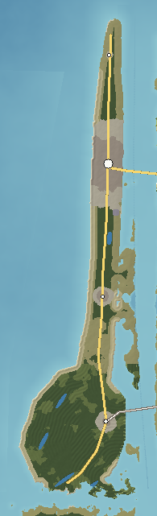

# Mirabel Island — Tourist Coast

Mirabel is a 30 km ribbon of sugar-white quartz sand between Serena Bay and the calm lagoon of Mirabel Sound, ending in a broad, pine-covered foreland. The Gulf side is gentle, warm and clear; the sunsets are straight out over open water. The northern half is a resort strip of condominium towers, motels, a long pier and a boardwalk of amusements; the southern foreland is wild beach, dune lakes and a lighthouse.

---

## 1. Geography

**Shape and size.** A narrow barrier island 0.6–1.2 km wide and 30 km long, widening at its southern end into a 6 km beach-ridge foreland. 85 km² of land; 89 km of coast. Highest ground 8 m (dune crests).

**Coastline.** The bay side (west) is a single, smooth, gently curved beach — the long-shore drift of the Gulf coast at work. The sound side (east) is irregular: marsh points, seagrass flats, small coves and docks. The south end wraps round Cape Serena; the north end tapers into **Seaholly Point**, a curving spit beside the tidal pass into Cassena Sound.

**Bays and peninsulas.** The **Mirabel foreland** — a fan of parallel beach ridges with long swales between them — and Cape Serena at its tip. Small lagoon coves on the sound side at Port Serena.

**Islands offshore.** Bellamy 0.4 km east across Mirabel Sound; Wickham 0.6 km south across the mouth of Ketch Sound.

**Dunes and ridges.** Dune ridges 4–8 m along the beach, highest at Dunewood; old parallel beach ridges across the foreland, each marking a former shoreline.

**Lakes.** Four coastal dune lakes in the foreland swales (Cypress Dune Lake, Little Serena Lake, Long Swale Lake, Oyster Lake) — freshwater lakes that occasionally break through the beach to the bay — and Lake Mirabel, an artificial golf-course lake in the resort.

**Wetlands.** Interdunal swales and the marshes of the sound shore.

**Forests.** Slash pine and live oak on the foreland ridges; sand pine and rosemary scrub on the old dunes south of Dunewood.

**Beaches.** Nine registered: Mirabel Beach, Pier Beach, Dunewood Beach, Turtle Crawl Beach, Lagoon Beach (sound side), Old Station Beach, Dune Lakes Beach, Cape Serena Beach and Seaholly Point.

**Why it looks like this.** Quartz sand washed down from the crystalline highlands by the rivers and carried along the Gulf shelf by waves has built a barrier in front of the old coastline (Bellamy's west shore). On a low-energy coast, waves sort that sand finely and leave it pure white. At the south end, where the barrier meets the mouth of Ketch Sound, sand has piled up in successive ridges as the shore advanced — the foreland.

## 2. Geological logic

- **Character:** pure quartz sand over shelly sand; no rock.
- **Soils:** none to speak of — white sand with a thin organic layer under the pines.
- **Erosion and deposition:** the beach is stable to slowly growing in the south (the foreland) and slowly eroding in the north around the pier, where the resort has been renourished with dredged sand. Seaholly Point migrates south and east with the pass.
- **Drainage:** rainwater soaks straight in; the water table is a freshwater lens floating on salt water, surfacing in the dune lakes and swales.
- **Flood-prone:** the whole island in a hurricane surge; the sound side in strong west winds.
- **Coastal erosion:** active north of the pier; storm overwash on low sections near Seaholly.

## 3. Visual identity

- **Dominant colours:** white sand and emerald-green to turquoise water.
- **Secondary colours:** pastel condominium towers, the black-and-white bands of Cape Serena Light, the dark green of the foreland pines, the gold of sea oats.
- **Vegetation:** sea oats on the dunes, rosemary scrub, slash pine and live oak on the foreland, seagrass in the sound.
- **Terrain silhouette:** flat, a thin white line; a wall of towers in the middle.
- **Skyline:** Condo Row (20–30 storeys), Mirabel Sands (the tallest tower), the pier's Ferris wheel, Cape Serena Light.
- **Architecture:** white and pastel condominium towers with balconies, mid-century one- and two-storey motels with neon signs, stilt houses on the dunes, wooden dune walkovers, seafood shacks on pilings.
- **Coastline:** a perfectly smooth white beach facing west.
- **Atmosphere:** bright, hazy, salt-humid; glittering water.
- **Signature feature:** **sunset over Serena Bay from the end of Mirabel Pier**, with the towers lit orange behind.

## 4. Transportation geography

**Roads.**
- **SR 30 Beach Road** (28.7 km): the island's only through road, from Seaholly to Port Serena and the lighthouse, behind the first dune line — the commercial strip in the resort section.
- **SR 40 Cross-Island Highway** reaches the island over the **Mirabel Causeway** (2.1 km with a bascule span over the inland waterway).
- **CR 30 Serena Causeway** crosses to Port Serena over a 1.9 km causeway with a high-rise span.
- Sand and shell roads into the foreland; beach access ways every few hundred metres; private drives to stilt houses.

**Bridges.** The Mirabel Causeway (why: shortest crossing of Mirabel Sound opposite the resort's centre) and the Serena Causeway Bridge (why: the foreland's sound shore is closest to Bellamy at Port Serena).

**Railroads.** None.

**Aviation.** Mirabel–Bellamy Regional Airport is across the causeway on Bellamy (the barrier island is too narrow for a runway).

**Maritime.** **Mirabel Pier** (450 m concrete fishing pier with a T-head); **Port Serena Marina** (charter boats, 3 m) on the lagoon side; the seasonal fast-ferry landing from Calder near the causeway; sound-side docks; the dredged inland waterway channel in Mirabel Sound.

## 5. Settlement pattern

| Settlement | Population | Why it is here |
|---|---|---|
| Mirabel Beach | 18,000 | The widest stretch of the barrier, directly across the sound from the causeway landing — the first place visitors arrive. |
| Port Serena | 3,000 | Marina town on the sheltered lagoon side of the foreland near the south bridge. |
| Dunewood | 1,200 | Beach village on the high dune section south of Mirabel Beach. |
| Seaholly | 500 | North-end village by the pass into Cassena Sound. |

The resort is a linear city: Condo Row on the beach side, the Strip along Beach Road, the Pier District, and mid-rise hotels thinning to beach houses to the north and south. Seasonal population is several times the permanent one. South of Dunewood, a short stretch has no streetlights (Turtle Crawl Beach); the foreland beyond Port Serena is undeveloped.

## 6. Exploration design

- **The foreland:** sand roads into pine ridges and hidden dune lakes; wild beach on its west shore.
- **The pier:** 450 m out over the Gulf, the best place to see the whole island.
- **Abandoned:** the Serena Waterslide Ruins (cracked pools, faded slides, vines) south of Dunewood; a concrete slab and pilings in the dunes at Old Station Beach.
- **Seaholly Point:** a moving spit where the tide runs fast in the pass.
- **The sound side:** kayak routes through seagrass flats and marsh islands.
- **Night:** the dark-sky beach at Turtle Crawl.

## 7. Visual landmark system

- **Primary:** Mirabel Sands (tallest tower on the island).
- **Secondary:** Cape Serena Light, Mirabel Pier.
- **Local:** the Serena Waterslide Ruins.
- **Micro:** the Lifesaving Station Slab.

## 8. Atmosphere

**Weather.** Hot, humid summers with sea-breeze storms building over Bellamy behind the island in the afternoon while the beach stays sunny; winter cold fronts bring north winds, clear water and the only surf of the year. Hurricanes from the Gulf in late summer and autumn.

**Fog.** Sea fog rolling onto the beach in late winter and early spring when warm air passes over the cooler bay.

**Lighting.**
- *Sunrise:* over Mirabel Sound, behind Bellamy — the towers' east faces glow.
- *Morning:* calm, glassy water, pelicans along the beach.
- *Noon:* blinding white sand.
- *Afternoon:* thunderheads stacked over the mainland side.
- *Golden hour:* the white beach turns gold; tower shadows reach the water.
- *Sunset:* straight out over Serena Bay — the island's defining moment.
- *Blue hour:* the pier lights and the Strip's neon.
- *Night:* the Strip and Ferris wheel lit; the foreland dark; the Cape Serena beam sweeping.

**Seasons.** *Spring*: windy, cool water, crowds beginning. *Summer*: full resort season, flat calm water. *Autumn*: warm water, storms, fewer people. *Winter*: quiet, clear, cool; surfers at the pier.

## 9. Environmental storytelling (physical evidence only)

- A water park's cracked pools and faded slides are swallowed by vines in the scrub.
- A concrete slab and rebar stubs lie in the dunes with pilings in the surf in front of them.
- Older one-storey motels with neon signs stand between new towers.
- Dune walkovers end in mid-air above a beach that has dropped.
- Dredge pipes and fresh, coarser sand show where the beach was renourished.

## 10. Biome distribution

| Zone | Where | Why |
|---|---|---|
| Beach and dune (sea oats) | The whole Gulf side | Wave- and wind-built sand. |
| Scrub (sand pine, rosemary) | Old dunes south of Dunewood | Dry, nutrient-poor sand. |
| Pine and live-oak forest | Foreland beach ridges | The oldest, most stable sand with organic soil. |
| Dune lakes and swales | Foreland swales | The freshwater lens at the surface. |
| Salt marsh and seagrass | Sound side | Sheltered lagoon. |
| Urban resort | Mirabel Beach | Development on the widest section. |

## 11. Human infrastructure

- **Power:** a 115 kV feed across the causeway on concrete poles; a small substation behind the Strip.
- **Water:** wells on Bellamy and a pipeline on the causeway; an elevated water tank painted with a beach scene.
- **Sewage:** Mirabel Beach Treatment Plant on the sound side.
- **Communications:** cell antennas on the condominium rooftops.
- **Construction:** at any time a new tower going up on Condo Row, with a crane on the skyline.
- **Beach works:** dune fences, renourishment pipes, lifeguard stands.

## Inspiration matrix

| Category | Inspiration | Why |
|---|---|---|
| Real-world geography | Florida Panhandle barrier islands; Cape San Blas–St Joseph Peninsula; Gulf coastal dune lakes | White quartz sand on a low-energy Gulf coast, a beach-ridge foreland, and rare coastal dune lakes. |
| Architecture | Gulf coast resort strips: condominium towers, neon motels, fishing piers | A resort that grew in layers. |
| Vegetation | Gulf barrier dunes and Florida scrub | Sea oats, rosemary scrub, sand pine. |
| Atmosphere | *Far Cry 6* | Saturated subtropical colour and bright water. |
| Exploration design | *Assassin's Creed IV: Black Flag* | A thin island read from the sea, with the wild end beyond the resort. |
| Landmark philosophy | *GTA V* (Vespucci and Del Perro) | Pier, Ferris wheel and tower as a beach skyline. |
| Environmental storytelling | *Fallout 3* | Abandoned leisure structures, unexplained. |

<!-- BEGIN GENERATED -->
### Measured from the generated terrain

| Measure | Value |
|---|---|
| Land area | 85 km² |
| Inland water | 1.0 km² |
| Sea coastline | 89 km |
| Greatest length | 29.6 km |
| Highest point | 8 m (unnamed) |
| Mean elevation | 4 m |
| Land below 3 m | 13% |
| Slopes steeper than 40% | 0% |
| Population | 22,700 |
| Longest drive | Port Serena – Seaholly, 22.9 km, 18 min |
| Register entries | 5 landmarks, 3 viewpoints, 9 beaches, 5 lakes, 2 forests, 0 summits, 4 districts |

**Land cover (share of land area)**

| Cover | Share | km² |
|---|---|---|
| Maritime live-oak forest | 43.0% | 36.7 |
| Sand-pine and oak scrub | 19.0% | 16.2 |
| Dunes and sea oats | 9.8% | 8.4 |
| Slash-pine flatwoods | 9.2% | 7.8 |
| Urban | 7.7% | 6.6 |
| Suburban | 7.6% | 6.4 |
| Beach sand | 2.4% | 2.1 |
| Freshwater marsh and wet prairie | 0.9% | 0.8 |

**Settlements**

| Settlement | Form | Population | Why here |
|---|---|---|---|
| Mirabel Beach | resort | 18,000 | Widest stretch of the barrier island, directly across Mirabel Sound from the causeway landing. |
| Port Serena | town | 3,000 | Marina town on the sheltered lagoon side of the beach-ridge foreland, near the south bridge. |
| Dunewood | resort | 1,200 | Planned beach village on the high dune section south of Mirabel Beach. |
| Seaholly | village | 500 | North-end village by the pass into Cassena Sound. |
<!-- END GENERATED -->
