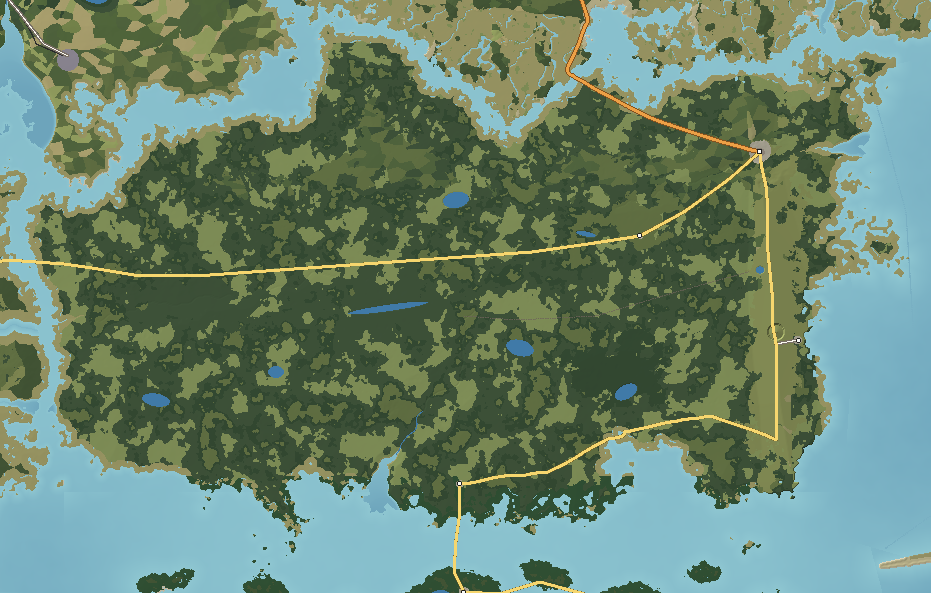

# Ossahatchee Island — Swamp and Wetland

Ossahatchee is a vast, nearly level swamp: 750 km² that rarely rises more than a few metres above the water table. Cypress domes, open "prairies" of sedge and water lily, bay-forest thickets on deep peat and dark, slow rivers cover almost all of it. Along its eastern edge runs **Long Ridge**, an old beach ridge 44 m high at its crest — the only dry ground, carrying the only town, the coastal highway and a strip of longleaf pine. Everything else is crossed by one road, The Trail, much of it on a raised causeway and a 4 km viaduct.

---

## 1. Geography

**Shape and size.** A broad, rounded island about 45 km east–west and 20 km north–south; 754 km² of land; 46 km greatest length; 379 km of coast. Highest point Highpine Knoll (44 m) on Long Ridge; most of the interior lies between 13 and 22 m above sea level but within a metre of its own water table.

**Coastline.** North on Ketch Sound: marsh and low pine shore. South on the Sabal Flats: salt marsh mixing with black mangrove — the northernmost mangroves in the islands. East on Tarrow Sound: Long Ridge comes close to the water at Tarrow Landing. West on Sawpit Pass: cypress strands meeting tidal marsh.

**Bays.** Turtle Bay on the south coast (a shell beach where the highway runs close to the water); the marsh-fringed mouths of the three rivers.

**Islands offshore.** Saint Ambrose 0.4 km north across Ketch Sound; Wickham 0.4 km west across Sawpit Pass; the Sabal Keys 1.4 km south; the Gannet Banks 5 km east across Tarrow Sound.

**Ridges.** **Long Ridge** — a relict Pleistocene beach ridge 1–2 km wide running north–south for 16 km down the island's east side, sandy, dry and fringed by a karst pond.

**Rivers.** Three blackwater rivers drain the swamp south-west and west: the **Little Black River** (21.6 km), the **Ossahatchee River** (13.1 km) and the **Gapway River** (13.0 km), all falling only 1–2 m per kilometre, stained the colour of tea by peat.

**Lakes.** Open-water lakes inside the swamp — **Big Water**, Cowhouse Lake, Sill Lake, Honey Lake, Black Lake and Dinner Pond — shallow peat-floored lakes surrounded by cypress; Long Ridge Pond (a sinkhole on the ridge); Borrow Pit Lake beside the highway.

**Wetlands.** The whole island: cypress swamp and domes, gum swamp along rivers, freshwater marsh prairies, bay forest on peat, wet pine flatwoods, salt marsh and mangrove on the coast.

**Forests.** Bald cypress and pond cypress, black gum, loblolly bay and sweetbay, slash pine on the flatwoods, longleaf on Long Ridge.

**Beaches.** One: Turtle Bay Beach (shell).

**Why it looks like this.** Ossahatchee is a broad, shallow basin of sand over clay that holds rain like a saucer, dammed on its east side by Long Ridge — an ancient barrier island now stranded inland. Water drains out only slowly westward through the rivers; peat has built up for thousands of years in the wettest parts, forming the bay-forest "islands" and floating mats.

## 2. Geological logic

- **Character:** sand over impermeable clay; peat up to several metres thick in the interior; the dune sand of Long Ridge.
- **Soils:** peat and muck in the swamp; wet sandy soils on the flatwoods; deep dry sand on the ridge.
- **Erosion and sedimentation:** almost none; peat accumulates; the rivers carry dissolved organic matter, not sediment.
- **Drainage:** sheet flow and slow channels; water level rises and falls seasonally by about a metre.
- **Flood-prone:** the whole interior in wet seasons — by design of nature; the Trail is raised for this reason.
- **Fire:** in drought years, peat fires smoulder for weeks.
- **Coastal change:** mangroves advance north in warm decades and are cut back by hard freezes.

## 3. Visual identity

- **Dominant colours:** dark olive cypress and the tea-black of the water.
- **Secondary colours:** the grey of Spanish moss and of dead cypress; the gold-green of sedge prairies; white water lilies; red maple in late winter.
- **Vegetation:** buttressed cypress with knees, moss-draped; open prairies; dense bay thickets.
- **Terrain silhouette:** a flat horizon of cypress domes — rounded islands of trees, tallest in the middle — on open prairie.
- **Skyline:** the Highpine Fire Tower on Long Ridge; the Big Water Tower; the long, low line of the Skyway.
- **Architecture:** cabins on stilts, fish camps, a few houses and stores along the highway on the ridge; a sawmill hamlet.
- **Coastline:** marsh and mangrove.
- **Atmosphere:** still, humid, insect-loud air; mist on dark water.
- **Signature feature:** **Big Water** — open black water in a ring of giant cypress, seen from the tower at the end of the boardwalk.

## 4. Transportation geography

**Highways.**
- **SR 17 Coastal Highway** arrives from Saint Ambrose over the **Ketch Sound Bridge** (concrete high-rise) and runs south along the crest of Long Ridge (the only dry route) to Tarrow Landing and the south coast, then west to Sabal Landing.
- **SR 29 The Trail** (54.4 km): from Ossahatchee town west across the entire swamp to the **Sawpit Pass Bridge** and Wickham. It runs on a raised causeway with culverts; across the deepest part of the swamp around Big Water it becomes the **Ossahatchee Skyway**, a 4 km wetland viaduct on concrete piles that lets the water flow under it. Its steepest grade is 2.1%; there is almost no curvature in 40 km.
- **CR 31 Tarrow Landing Road** to the ferry and seaplane base.
- **Unpaved:** a few sand roads on the ridge; airboat trails and canoe trails replace roads in the swamp.

**Bridges.** The Ketch Sound Bridge (navigable sound), the Sawpit Pass Bridge (swing span on the inland waterway), the Skyway.

**Railroads.** The **Ossahatchee Cypress Tram** (abandoned, 14.6 km): a raised logging grade running dead straight into the swamp from Long Ridge, rails gone, crossties rotting.

**Aviation.** **Tarrow Landing Seaplane Base**: a ramp and floats on Tarrow Sound.

**Maritime.** The **Tarrow Sound Ferry** (vehicle ferry, 12 knots) from Tarrow Landing across the lagoon to Pennick on the Gannet Banks; boat ramps at the river mouths; airboat landings along the Trail.

## 5. Settlement pattern

| Settlement | Population | Why it is here |
|---|---|---|
| Ossahatchee | 2,600 | Dry ground at the north end of Long Ridge where the coastal highway lands from Ketch Sound and the Trail turns west into the swamp. |
| Tarrow Landing | 450 | Ferry and seaplane landing where Long Ridge comes closest to Tarrow Sound. |
| Sabal Landing | 300 | Mainland end of the Keys bridges on the marsh coast. |
| Tolar | 120 | A sawmill hamlet on a dry pine island along the Trail. |

Everything sits on the ridge or on a "pine island" — a patch of ground a metre higher than the swamp. Fish camps and hunting cabins on stilts line the river mouths.

## 6. Exploration design

- **Boardwalks:** the Big Water boardwalk to its tower; short loops off the Trail.
- **Canoe and airboat trails:** marked routes through prairies and cypress; the Hollow Cypress, an ancient tree with a trunk you can paddle into.
- **The Sill Canal:** an 8 km straight canal dug into the swamp from Long Ridge with a spoil bank along one side — the only straight line inside the swamp.
- **The tram grade:** a raised, walkable line deep into the interior.
- **Fish camps:** stilt cabins and a bait shop at the Little Black River.
- **Pine islands:** Tolar's sawdust piles and mill foundations in second-growth pine.
- **The south coast:** grey skeletons of freeze-killed mangroves with green regrowth.
- **Fire tower:** Highpine, on the ridge, the only place to see the whole swamp.

## 7. Visual landmark system

- **Secondary:** the Ossahatchee Skyway, the Big Water Tower, the Highpine Fire Tower.
- **Local:** the Sill Canal, the Cypress Tram Grade, the Little Black Fish Camp, the Trail Airboat Landing.
- **Micro:** the Hollow Cypress, the Freeze-Killed Mangroves.

## 8. Atmosphere

**Weather.** The hottest, most humid island in summer: daily thunderstorms, lightning, heavy rain raising the water. Mild winters with fog; rare hard freezes.

**Fog.** Thick morning fog over the prairies and lakes from October to April; mist in the cypress all day after rain.

**Lighting.**
- *Sunrise:* through fog, with the cypress domes as dark shapes.
- *Morning:* light shafts through moss.
- *Noon:* white, glaring prairies; the dark water reflecting the sky.
- *Afternoon:* thunderheads, then rain.
- *Golden hour:* the prairies glow; the cypress trunks orange.
- *Sunset:* behind a cypress dome across Big Water.
- *Blue hour:* frogs, insects, alligator calls.
- *Night:* very dark, loud; fireflies in spring.

**Seasons.** *Spring*: the driest season; fire risk; water lilies blooming. *Summer*: high water, storms. *Autumn*: cypress needles turn rust-orange before dropping. *Winter*: bare grey cypress, fog, low water, red maple flowers.

## 9. Environmental storytelling (physical evidence only)

- A straight raised grade with rotting crossties runs into the swamp and ends at nothing.
- An 8 km canal runs dead straight into the swamp with a spoil bank on one side.
- Giant cypress stand among stumps; all the giants are hollow.
- Sawdust piles and concrete mill foundations sit in a pine forest of even-aged trees.
- Grey dead mangroves stand along the south coast with green ones sprouting among them.

## 10. Biome distribution

| Zone | Where | Why |
|---|---|---|
| Cypress swamp and domes | Permanently flooded depressions | Standing water most of the year. |
| Freshwater marsh (prairies) | Shallow open basins | Seasonally flooded, often burned. |
| Bay forest | Deep peat | Saturated, acid, fire-sheltered. |
| Gum swamp | River corridors | Flowing blackwater. |
| Wet pine flatwoods | Slightly higher sand (north of the island) | Seasonal saturation. |
| Longleaf | Long Ridge | Dry sand. |
| Salt marsh and mangrove | South coast | Tidal; mangroves at their freeze limit. |

## 11. Human infrastructure

- **Power:** the Long Ridge Substation (115 kV from Haversham) and distribution along the highway; a line along the Trail on wooden poles.
- **Water:** wells on the ridge; a water tower at Ossahatchee town.
- **Drainage:** culverts under the Trail every few hundred metres; the Sill Canal.
- **Communications:** a cell tower beside the fire tower.
- **Fire management:** the Highpine Fire Tower, firebreaks on the ridge.
- **Borrow pits:** the flooded pit beside the highway that supplied the causeway fill.
- **Fuel:** a single gas station and store at the junction in Ossahatchee town.

## Inspiration matrix

| Category | Inspiration | Why |
|---|---|---|
| Real-world geography | Okefenokee Swamp and Trail Ridge (GA/FL); Big Cypress and the Tamiami Trail (FL) | A peat swamp held behind a relict beach ridge, crossed by one long causeway road. |
| Architecture | Fish camps and stilt cabins; swamp-edge sawmill hamlets | Building only where the ground allows. |
| Vegetation | Cypress domes, prairies, bay forest | Water depth and duration decide everything. |
| Atmosphere | *The Witcher 3* (Crookback Bog); *Red Dead Redemption 2* (Lemoyne bayou) | Fog, stillness, dark water. |
| Exploration design | *Metro Exodus* (the Volga) | Moving through wetland by boat, boardwalk and causeway. |
| Landmark philosophy | *STALKER* | Few landmarks, each standing out against flat, uniform country. |
| Environmental storytelling | *Days Gone* | Industrial traces — canals, tram grades, mill ruins — slowly absorbed. |

<!-- BEGIN GENERATED -->
### Measured from the generated terrain

| Measure | Value |
|---|---|
| Land area | 754 km² |
| Inland water | 4.9 km² |
| Sea coastline | 379 km |
| Greatest length | 46.4 km |
| Highest point | Highpine Knoll, 44 m |
| Mean elevation | 14 m |
| Land below 3 m | 13% |
| Slopes steeper than 40% | 0% |
| Population | 3,470 |
| Longest drive | Tolar – Sabal Landing, 38.6 km, 32 min |
| Register entries | 9 landmarks, 3 viewpoints, 1 beaches, 8 lakes, 6 forests, 1 summits, 0 districts |

**Land cover (share of land area)**

| Cover | Share | km² |
|---|---|---|
| Cypress–tupelo swamp | 41.5% | 313.1 |
| Freshwater marsh and wet prairie | 18.9% | 142.4 |
| Bay forest and pocosin | 14.0% | 105.4 |
| Slash-pine flatwoods | 10.1% | 76.3 |
| Salt marsh (cordgrass, needlerush) | 7.0% | 52.9 |
| Longleaf pine savanna | 4.5% | 33.9 |
| Black and red mangrove | 2.0% | 14.8 |
| Pine plantation | 1.7% | 13.1 |

**Settlements**

| Settlement | Form | Population | Why here |
|---|---|---|---|
| Ossahatchee | town | 2,600 | Dry ground at the north end of Long Ridge where the coastal highway lands from Ketch Sound and the Trail turns west into the swamp. |
| Tarrow Landing | village | 450 | Ferry and seaplane landing where Long Ridge comes closest to Tarrow Sound. |
| Sabal Landing | hamlet | 300 | Mainland end of the Keys bridges on the marsh coast. |
| Tolar | hamlet | 120 | Sawmill hamlet on a dry pine island along the Trail. |

**Rivers**

| River | Length | Fall | Gradient |
|---|---|---|---|
| Little Black River | 21.6 km | 24 m | 1.1 m/km |
| Ossahatchee River | 13.1 km | 25 m | 1.9 m/km |
| Gapway River | 13.0 km | 27 m | 2.0 m/km |
<!-- END GENERATED -->
