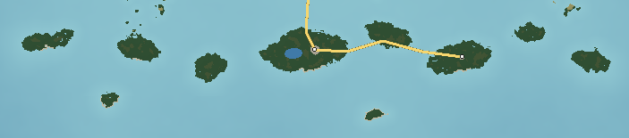

# The Sabal Keys — Mangrove Keys

The Sabal Keys are the archipelago's southern end: a scatter of a dozen low islands of limestone, shell and mangrove peat strung east–west across the shallow, glassy Sabal Flats. Nothing stands more than 2 m above the sea. The water around them is clear, turquoise over sand and dark green over seagrass. A chain of low concrete bridges hops from the Ossahatchee coast to the two inhabited keys; the rest are reached by boat or by wading at low tide.

---

## 1. Geography

**Shape and size.** About 12 keys from 0.1 to 4 km across, spread over 32 km of the flats; 26 km² of land in total; 80 km of shoreline. Highest ground 2 m on shell ridges.

**The keys.** **Sabal Key** (the largest, with the village and the salt pond), **Cayo Viento** (the windward key at the end of the highway), Bonefish Key, Turtlegrass Key, Pelican Key, and **Cayo Lejos**, the outermost, with a skeletal iron light.

**Coastline.** Mangrove fringes on the lee (north) sides; shell and limestone-rubble beaches on the windward (south) sides; tidal channels between keys.

**Bays and channels.** The **Sabal Channel** (a natural tidal channel along the north of the keys, 2–3 m deep) and the flats themselves (less than 1 m at low tide over large areas).

**Islands offshore.** Ossahatchee 1.4 km north; the Gannet Banks 5 km east (Pennick); Wickham 6.4 km north-west.

**Lakes.** The **Sabal Salt Pond** — a hypersaline pond in the middle of Sabal Key, pink in summer.

**Wetlands.** Red mangrove on the water's edge, black mangrove behind it with its pencil-like breathing roots, salt flats.

**Forests.** Mangrove; small hammocks of buttonwood, sea grape and cabbage palm on the shell ridges.

**Beaches.** Sabal Key Beach (coarse white shell and limestone fragments), Cayo Viento Beach (windswept, with stilt houses), Bonefish Bar (a sandbar joining keys at low tide), Cayo Lejos (a ring of shell beach), Turtlegrass Key Beach.

**Why they look like this.** The keys sit on the edge of a shallow limestone platform where the water is warmest; shell and coral-like rubble thrown up by storms make the ridges, and mangroves trap sediment and peat around them. They are at the northern limit for mangroves — the occasional hard freeze kills them back, which is why grey dead stands appear among green ones on the Ossahatchee coast nearby.

## 2. Geological logic

- **Character:** limestone platform, shell ridges, mangrove peat.
- **Soils:** marl, shell, peat.
- **Erosion and deposition:** storms build shell ridges on the windward side and erode lee shores; the mangroves build land slowly.
- **Drainage:** none; rain soaks into shell and peat.
- **Flood-prone:** the entire chain in any tropical storm; normal spring tides cover the low edges.

## 3. Visual identity

- **Dominant colours:** turquoise water, dark green mangrove, white shell.
- **Secondary colours:** the pink salt pond; pastel stilt houses; the rust of the screwpile light.
- **Vegetation:** red mangrove arching roots, black mangrove, sea grape, palms.
- **Terrain silhouette:** completely flat islands floating on bright water.
- **Skyline:** the Cayo Lejos light; the long low line of the bridges.
- **Architecture:** wooden stilt houses painted in pastels; a fish house on pilings; a bait shop at Mile Zero.
- **Coastline:** mangrove walls and shell beaches.
- **Atmosphere:** brilliant light, warm breeze, total calm on the flats.
- **Signature feature:** **the Sabal Bridges** — a chain of low trestles skimming the flats from key to key.

## 4. Transportation geography

**Roads.** **SR 17** ends at Sabal Landing on the Ossahatchee coast; **SR 1 Keys Highway** (14 km, almost dead flat) continues over the **Sabal Bridges** (2.75 km of low concrete trestles, 4 m clearance, with two more crossings of 1.8 km each) to Sabal Key, then to Cayo Viento, where a sign marks Mile Zero. The road on the keys is a single strip with sand shoulders.

**Bridges.** Low trestles because the water is too shallow for anything but skiffs; one higher span over the Sabal Channel for fishing boats.

**Railroads and aviation.** None.

**Maritime.** **Sabal Fish House** (2 m, on pilings); skiff docks at every house; kayak launches at the bridges.

## 5. Settlement pattern

| Settlement | Population | Why it is here |
|---|---|---|
| Sabal | 600 | Fishing village on the largest key, at the end of the bridges. |
| Cayo Viento | 150 | Stilt-house hamlet on the windward key. |

Everything else is uninhabited.

## 6. Exploration design

- **Wading:** Bonefish Bar connects keys at low tide.
- **Paddling:** mangrove tunnels between keys.
- **Remote keys:** Pelican Key's rookery; Cayo Lejos and its iron light, a ring of shell around a lagoon.
- **The end of the road:** the Mile Zero marker on Cayo Viento.
- **Flats:** seagrass, rays, small sharks and tailing fish visible from the bridges.

## 7. Visual landmark system

- **Secondary:** the Sabal Bridges, Cayo Lejos Light.
- **Micro:** the SR 1 Mile Zero marker, the Pelican Key Rookery.

From the keys, the long views are north — the Highpine Fire Tower on Long Ridge, and on clear days the plumes of the Ocosta cooling towers.

## 8. Atmosphere

**Weather.** The warmest island: mild winters, hot summers moderated by sea breezes, storms forming over Ossahatchee in the afternoon and passing north of the keys. The most exposed place to tropical storms.

**Fog.** Rare; occasional sea mist in winter mornings over the flats.

**Lighting.**
- *Sunrise:* pink light over flat water from Cayo Viento.
- *Morning:* the flats like glass, every seagrass blade visible.
- *Noon:* blinding white and turquoise.
- *Afternoon:* towering clouds over the land to the north.
- *Golden hour:* mangroves glow green-gold.
- *Sunset:* over the western keys, the water orange.
- *Blue hour:* the screwpile light starts.
- *Night:* stars, the light, no other lights beyond Sabal.

**Seasons.** Little change; winter brings clearer water and north winds; summer brings storms; autumn the hurricane season.

## 9. Environmental storytelling (physical evidence only)

- Grey dead mangroves stand among green ones.
- Pilings of older docks stand in the water off the fish house.
- An iron light on screw piles stands alone on the outermost key.
- A stilt house with its stairs gone, standing over the water.

## 10. Biome distribution

| Zone | Where | Why |
|---|---|---|
| Red mangrove | Water's edge | Tidal inundation. |
| Black mangrove | Behind the red | Higher tidal flats. |
| Buttonwood and sea-grape hammock | Shell ridges | The only ground above normal tides. |
| Salt flat and salt pond | Interior of Sabal Key | Evaporation in an enclosed basin. |
| Shell beach | Windward shores | Storm-built rubble. |
| Seagrass | The flats | Clear, shallow, warm water. |

## 11. Human infrastructure

- **Power:** a single distribution line on the bridges; standby generators.
- **Water:** a pipeline on the bridges; rainwater cisterns.
- **Sewage:** a small package plant on Sabal Key.
- **Navigation:** Cayo Lejos Light, channel markers on the Sabal Channel.
- **Communications:** a single cell tower on Sabal Key.

## Inspiration matrix

| Category | Inspiration | Why |
|---|---|---|
| Real-world geography | The Florida Keys and the Ten Thousand Islands; Cedar Key (FL) | Low limestone and mangrove keys on shallow flats at the edge of the subtropics. |
| Architecture | Keys stilt houses, fish houses on pilings | Building above water and storm surge. |
| Vegetation | Mangrove, buttonwood, seagrass | The subtropical coastal edge. |
| Atmosphere | *Far Cry 3* | Bright, saturated tropical water and light. |
| Exploration design | *Assassin's Creed IV: Black Flag* | Islands reached by boat across shallows. |
| Landmark philosophy | *Assassin's Creed IV: Black Flag* | Lights and bridges as the markers of a flat sea. |
| Environmental storytelling | *Far Cry 6* | Storm damage and the sea reclaiming structures. |

<!-- BEGIN GENERATED -->
### Measured from the generated terrain

| Measure | Value |
|---|---|
| Land area | 26 km² |
| Inland water | 0.5 km² |
| Sea coastline | 80 km |
| Greatest length | 32.2 km |
| Highest point | 2 m (unnamed) |
| Mean elevation | 1 m |
| Land below 3 m | 100% |
| Slopes steeper than 40% | 0% |
| Population | 750 |
| Longest drive | Sabal – Cayo Viento, 8.4 km, 7 min |
| Register entries | 4 landmarks, 1 viewpoints, 5 beaches, 1 lakes, 0 forests, 0 summits, 0 districts |

**Land cover (share of land area)**

| Cover | Share | km² |
|---|---|---|
| Black and red mangrove | 86.6% | 22.6 |
| Maritime live-oak forest | 10.3% | 2.7 |
| Beach sand | 2.1% | 0.6 |
| Suburban | 1.0% | 0.3 |

**Settlements**

| Settlement | Form | Population | Why here |
|---|---|---|---|
| Sabal | village | 600 | Fishing village on the largest key, at the end of the Keys bridges. |
| Cayo Viento | hamlet | 150 | Stilt-house hamlet on the windward key. |
<!-- END GENERATED -->
