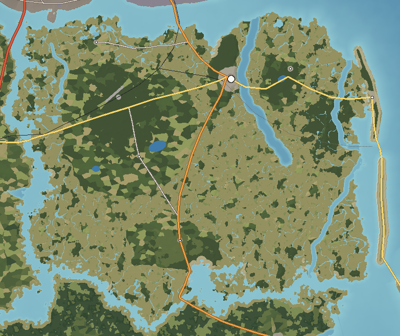

# Saint Ambrose Island — Lowcountry

Saint Ambrose is more marsh than land. Two-thirds of its 764 km² lies below 3 m — an endless golden plain of cordgrass cut by tidal creeks that fill and empty twice a day. Rising out of it are the sea-island cores: low ridges of old dune sand a few metres high, dark with live oak, palmetto and hanging moss, where the roads, farms and towns are. On its Atlantic edge a separate barrier, Ambrose Beach, takes the surf. Haversham, a port town of white steeples and porch-fronted houses, sits on the island's one real bluff above its deepest tidal river.

---

## 1. Geography

**Shape and size.** A broad, ragged island about 30 km across, 764 km² including the Ambrose Beach barrier; 40 km greatest length; over 1,100 km of shoreline when every creek bank is counted — the most intricate coast in the islands. Highest natural ground about 9 m on the sea-island cores; two-thirds of the island lies below 3 m.

**Coastline.** Marsh on every side except the Atlantic. Tidal rivers penetrate deep into the island: the **Haversham River** (a 15 km drowned valley, the deepest), the **Bonnet River** behind Ambrose Beach, **Salt Kettle Creek** and **Oyster Creek**.

**Sea-island cores.** **Ambrose Main** (the largest, west of Haversham), **Haversham Neck** (the bluff under the town), **Edgewater Island**, **Oyster Hammock**, **Kettle Island** (the southern core). Between them, marsh with scattered palm-and-cedar hammocks.

**The barrier.** **Ambrose Beach** — a 25 km chain of barrier islands separated from the sea islands by the Bonnet River marsh, cut by Bonnet Inlet and Ambrose Inlet.

**Islands offshore.** Corliss 2.1 km north; Calder 0.7 km north-west across the Sound; Bellamy 0.3 km west across the Ashwood River; Ossahatchee 0.4 km south across Ketch Sound; the Gannet Banks 2.4 km south across Ambrose Inlet.

**Rivers, lakes and ponds.** Tidal rivers (no freshwater rivers); the Rice Reserve (a freshwater impoundment held by earthen dikes), Cypress Pond in the live-oak forest, Heron Pond (a diked brackish pond on Edgewater).

**Wetlands.** Salt marsh (smooth cordgrass on creek banks, black needlerush higher up), brackish marsh up the rivers, freshwater marsh in the old rice fields, salt pans (bare, crusted flats in the high marsh).

**Forests.** Maritime forest of live oak, cabbage palm and magnolia with Spanish moss on the cores; slash pine and palmetto on Kettle Island; hammocks in the marsh.

**Beaches.** Ambrose Beach (wide, hard-packed tan sand with a big tidal range), Bonnet Inlet Beach (sandbars and currents), Boneyard Beach (dead trees on an eroding shore), South Ambrose Beach, and shell beaches at Oyster Point and Kettle.

**Geological formations.** The Kettle Shell Ring (an 80 m ring of oyster shell four metres high), the boneyard of salt-killed trees.

**Why it looks like this.** The cores are Pleistocene barrier islands stranded when sea level was a few metres higher; the marsh has filled in behind them since. The modern barrier (Ambrose Beach) is a Holocene island in front. Tides here are the largest in the archipelago (about 2.5 m), so the marsh is huge, the creeks are deep, and the beach is wide at low water. Haversham sits on the highest bluff where the deepest tidal channel runs right against the shore.

## 2. Geological logic

- **Character:** sand (old dune and beach ridges), marsh mud, oyster shell.
- **Soils:** sandy, acid soils on the cores; black, sulphurous marsh mud; shell middens and shell-hash beaches.
- **Erosion and deposition:** marsh accretes slowly; creeks meander and cut banks; the Ambrose barrier is migrating landward — eroding on its front (Boneyard Beach, the houses in the surf) and building at its inlets.
- **Drainage:** tidal. Fresh water stays near the surface on the cores; the old rice fields were diked to hold it.
- **Flood-prone:** everything below 3 m in storm surge; Bay Street's lower end at spring high tides.
- **Coastal erosion:** severe on the north end of Ambrose Beach and at Boneyard Beach.

## 3. Visual identity

- **Dominant colours:** gold and green marsh grass under a wide sky; dark live-oak green.
- **Secondary colours:** silver-grey Spanish moss; white steeples and white wooden houses; the blue of porch ceilings; grey tabby; the mud's sheen at low tide.
- **Vegetation:** cordgrass and needlerush, live oaks with moss, palmettos, cedar hammocks.
- **Terrain silhouette:** perfectly flat — the horizon is a line of trees on the next core.
- **Skyline:** Haversham's three steeples; the Bonnet Marsh observation tower; the Ambrose Inlet Bridge.
- **Architecture:** raised houses with deep porches and pale-blue porch ceilings on The Point; brick and tabby stores along Bay Street; shrimp docks with ice houses and net lofts; farmhouses on brick piers under oaks.
- **Coastline:** marsh edges, oyster reefs, mudflats; a tan beach on the Atlantic.
- **Atmosphere:** humid, still, the smell of marsh mud; heat shimmer; fog on creeks.
- **Signature feature:** **the marsh at golden hour**, seen from the Haversham bluff or a causeway — a gold plain with the tide coming in.

## 4. Transportation geography

**Highways.**
- **SR 17 Coastal Highway** (4-lane north of Haversham): from Corliss across the **South Sound Bridge** (3 km twin concrete trestles) to Haversham, then south down the island and across Ketch Sound on the **Ketch Sound Bridge** (a concrete high-rise) to Ossahatchee.
- **SR 40 Cross-Island Highway**: west from Haversham over the **Ashwood River Bridge** to Bellamy.
- **SR 14 Banks Highway**: from Haversham east on causeways across the Edgewater marshes, over the **Haversham River Bridge** (1,100 m, steel bascule) and the **Bonnet Inlet Bridge** (1,575 m, concrete girder), then south down Ambrose Beach and over the **Ambrose Inlet Bridge** (2,300 m concrete high-rise, 20 m clearance) to the Gannet Banks.
- **County roads:** Oyster Point Road (CR 17) to the shrimping village; Rice Hope Road (CR 40) to the old rice fields and Kettle.
- **Dirt and shell roads** under oak canopies on every core; dike tops through the rice fields.

**Bridges.** Every bridge here exists because the road must cross a tidal river or inlet; the high-rise spans are on navigable channels (Ambrose Inlet, Ketch Sound), the low trestles and bascules on shallow ones.

**Railroads.** The **Bellamy & Southern** crosses the north of the island on a timber trestle with a swing span (South Sound Rail Bridge) and an embankment across the marsh; the **Haversham Branch** (6.3 km) serves the town's docks. The **Ambrose Beach Line** (abandoned) ran on a trestle across the Bonnet marsh to the beach; a line of its pilings still stands in the marsh.

**Aviation.** **Haversham Regional Airport** (04/22, 2,130 m) on the dry core north-west of town, at 6 m.

**Maritime.** **Haversham Shrimp Docks** (5 m), **Oyster Point Docks** (3 m), boat ramps on every tidal river, a marina at Ambrose Beach on the Bonnet River.

## 5. Settlement pattern

| Settlement | Population | Why it is here |
|---|---|---|
| Haversham | 28,000 | The highest bluff on the island fronting the deepest tidal river — a natural deep-water landing, central to the island's farmland. |
| Ambrose Beach | 3,000 | The barrier beach reached by the causeway across the Bonnet marsh. |
| Edgewater | 900 | On the sea-island core across the Haversham River from town. |
| Oyster Point | 800 | Shrimping village on Oyster Hammock, the closest high ground to the Corliss fish market. |
| Kettle | 600 | Hamlet on Kettle Island where the coastal highway leaves for Ketch Sound. |
| Rice Hope | 300 | Farm hamlet on the edge of the old rice-field impoundments. |

**Rural pattern.** Settlement only on the cores: small farms, houses set under oaks at the ends of long shaded drives, trailers on blocks, fish camps on creek banks. Nobody lives on the marsh. **Commercial**: Bay Street and Uptown Haversham, a short strip at the airport road, beach shops at Ambrose Beach.

## 6. Exploration design

- **Oak tunnels:** dirt roads under arching live oaks and moss on Ambrose Main.
- **Tidal creeks:** navigable only near high tide; landings, fish camps and duck blinds along them.
- **Hammocks:** small islands of palm and cedar in the marsh, reached by boat or on foot at low tide.
- **The rice fields:** dikes to walk on, wooden trunk gates, fresh water full of alligators and wading birds.
- **Shell and tabby:** the Kettle Shell Ring hidden under cedars; roofless tabby walls in the Kettle woods.
- **The beach:** Boneyard Beach with its standing dead trees; the houses in the surf at the north end; the long inlet bridges.
- **Observation:** the Bonnet Marsh Tower — a wooden tower over the marsh with a view to the sea.

## 7. Visual landmark system

- **Secondary:** Haversham Steeples, the Ambrose Inlet Bridge.
- **Local:** the Kettle Shell Ring, the Kettle Tabby Ruins, the Rice Hope Trunk Gates, the Beach Line Trestle Pilings, the Boneyard Beach Trees, the Houses in the Surf.
- **Micro:** the Rice Hope Bottle Tree.

Saint Ambrose has no primary landmark of its own: on a flat island the eye goes outward, and its long views are of other islands' landmarks — the Corliss stacks, the Calder skyline, the WCDR mast and the Gannet Banks lighthouse.

## 8. Atmosphere

**Weather.** Heavy, humid summers with sea-breeze storms; mild winters; nor'easters in autumn and winter bringing high tides and cold rain; hurricanes from the Atlantic.

**Fog.** Marsh and creek fog on calm mornings from autumn to spring, thick enough to hide the far bank; sea fog onto Ambrose Beach in spring.

**Lighting.**
- *Sunrise:* over the Atlantic from Ambrose Beach, with the tide-flats mirroring the sky.
- *Morning:* fog lifting off the marsh; light through moss.
- *Noon:* white, hazy, shadowless.
- *Afternoon:* storm walls over the mainland to the west.
- *Golden hour:* the marsh at its most beautiful — gold grass, pink water.
- *Sunset:* behind the Haversham steeples, seen across the river from Edgewater.
- *Blue hour:* frogs and insects begin; shrimp boat lights.
- *Night:* very dark marsh; the town's lights reflected in the river.

**Seasons.** *Spring*: green marsh, azaleas under the oaks. *Summer*: heavy heat, bright green marsh, mosquitoes. *Autumn*: the marsh turns gold, king tides flood the roads. *Winter*: brown marsh, clear cool days, migratory birds in the rice fields.

## 9. Environmental storytelling (physical evidence only)

- Dead, bleached trees stand on the beach in the surf line.
- Beach houses stand on their pilings in the waves, the dune in front of them gone.
- A line of timber pilings crosses the marsh in a straight line from the town toward the beach.
- Wooden trunk gates and earthen dikes divide a freshwater marsh into rectangles.
- Roofless tabby walls stand in the woods with trees growing inside them.
- An avenue of huge oaks leads to an empty clearing with a few bricks in the grass.
- A ring of oyster shell four metres high hides under cedars.

## 10. Biome distribution

| Zone | Where | Why |
|---|---|---|
| Salt marsh | Below about 1.7 m, along creeks and sounds | Tidal flooding twice a day. |
| Brackish and freshwater marsh | Up the rivers; old rice fields | Fresh water from the cores; diked impoundments. |
| Maritime forest (live oak, palm, magnolia) | Sea-island cores | Highest, sandiest ground, sheltered from salt spray. |
| Pine and palmetto | Kettle Island | Drier sand. |
| Hammocks | Small rises in the marsh | A few centimetres of extra height. |
| Beach and dune | Ambrose Beach | Atlantic barrier. |
| Cropland and pasture | Ambrose Main | The only farmable ground. |
| Town | Haversham Neck | The bluff. |

## 11. Human infrastructure

- **Power:** the Haversham Substation, fed at 230 kV from Corliss across the Sound; 115 kV lines south to Ossahatchee and Kestrel on wooden H-frame poles across the marsh.
- **Water:** wells into the deep aquifer; a water tower on Haversham Neck.
- **Sewage:** Haversham Treatment Plant on the river.
- **Communications:** cell towers on the cores.
- **Fishing industry:** ice houses, net lofts, seafood packers at the shrimp docks.
- **Drainage:** tide gates and roadside ditches; dikes and trunks in the rice fields.

## Inspiration matrix

| Category | Inspiration | Why |
|---|---|---|
| Real-world geography | South Carolina and Georgia sea islands; the Lowcountry rice coast; Georgia barrier beaches with boneyard beaches | Pleistocene cores, Holocene barrier, huge tidal marsh and deep tidal rivers. |
| Architecture | Beaufort and Georgetown (SC) style towns; tabby; raised Lowcountry houses | The building forms of the tidal coast. |
| Vegetation | Maritime live-oak forest; Spartina and Juncus marsh | The defining plant communities of the sea islands. |
| Atmosphere | *Red Dead Redemption 2* (Bluewater Marsh) | Fog, heat and light over marsh. |
| Exploration design | *The Witcher 3* (Velen's waterways) | Getting around by creeks, dikes and causeways. |
| Landmark philosophy | *Assassin's Creed IV* | Flat land read by what can be seen across the water. |
| Environmental storytelling | *Days Gone* | Erosion and abandonment told by objects in the landscape. |

<!-- BEGIN GENERATED -->
### Measured from the generated terrain

| Measure | Value |
|---|---|
| Land area | 764 km² |
| Inland water | 2.2 km² |
| Sea coastline | 1,112 km |
| Greatest length | 40.1 km |
| Highest point | 9 m (unnamed) |
| Mean elevation | 2 m |
| Land below 3 m | 66% |
| Slopes steeper than 40% | 0% |
| Population | 33,600 |
| Longest drive | Ambrose Beach – Kettle, 32.2 km, 24 min |
| Register entries | 9 landmarks, 3 viewpoints, 6 beaches, 3 lakes, 5 forests, 0 summits, 4 districts |

**Land cover (share of land area)**

| Cover | Share | km² |
|---|---|---|
| Salt marsh (cordgrass, needlerush) | 52.4% | 400.2 |
| Maritime live-oak forest | 22.1% | 169.0 |
| Pine–hardwood forest | 5.2% | 40.1 |
| Pasture and hay | 4.6% | 35.4 |
| Pine plantation | 4.6% | 35.0 |
| Cropland | 3.1% | 23.7 |
| Freshwater marsh and wet prairie | 2.9% | 22.4 |
| Dunes and sea oats | 2.1% | 16.3 |
| Slash-pine flatwoods | 1.4% | 10.9 |
| Suburban | 0.5% | 4.1 |

**Settlements**

| Settlement | Form | Population | Why here |
|---|---|---|---|
| Haversham | town | 28,000 | The highest bluff on the island fronting the deepest tidal river: dry ground beside a natural deep-water landing, central to the island's farmland. |
| Ambrose Beach | resort | 3,000 | Holocene barrier beach reached by the causeway across the Bonnet River marsh. |
| Edgewater | village | 900 | Village on the sea-island core across the Haversham River from town. |
| Oyster Point | village | 800 | Shrimping village on Oyster Hammock, the closest high ground to the Corliss fish market. |
| Kettle | hamlet | 600 | Hamlet on Kettle Island, the southern sea-island core, where the coastal highway leaves for Ketch Sound. |
| Rice Hope | hamlet | 300 | Farm hamlet on the edge of the old rice-field impoundments. |

**Rivers**

| River | Length | Fall | Gradient |
|---|---|---|---|
| Bonnet River | 15.3 km | tidal | tidal throughout |
| Haversham River | 15.1 km | tidal | tidal throughout |
| Salt Kettle Creek | 13.2 km | tidal | tidal throughout |
| Oyster Creek | 6.3 km | tidal | tidal throughout |
<!-- END GENERATED -->
