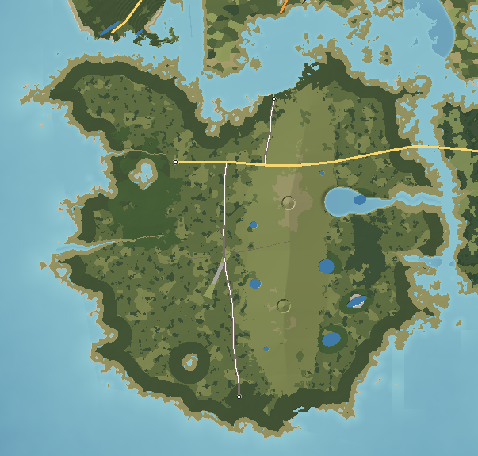

# Wickham Island — Wilderness

Wickham is the island nobody settled. Limestone lies just under its surface and a ridge of ancient white dune sand runs down its middle; the sand is too poor to farm, the limestone too porous to hold a pond, and the coast is oyster bar and marsh rather than beach. What it has instead are springs — clear, cold, electric-blue boils of water rising from the rock — and a dry ridge of longleaf pine and scrub that burns every few years. Fewer than 500 people live on 440 km².

---

## 1. Geography

**Shape and size.** A rounded, lobed island about 25 km across; 440 km² of land; 30 km greatest length; 313 km of coast. Highest point Scrub Hill, 76 m; mean elevation 11 m.

**Coastline.** The west and south coasts (on Serena Bay and the Gulf) are low, marshy and fringed by oyster bars and shell ridges — very little wave energy and very little sand reach them. The north coast on Ketch Sound is low marsh with a ferry landing. The east coast faces Sawpit Pass, where the Sawpit River enters through a cypress strand. One true beach, Hurricane Beach, faces south-east where storm waves reach.

**Points and peninsulas.** **Cedar Point** in the south — a shell ridge with red cedars and a fish-house hamlet; the mouths of the two spring runs on the west coast.

**Islands offshore.** Bellamy 0.3 km north across Ketch Sound; Mirabel 0.6 km north-west; Ossahatchee 0.4 km east across Sawpit Pass; the Sabal Keys 6 km south-east.

**Ridges.** The **Sandhill Ridge** runs north–south down the island's centre: deep white sand 40–76 m high, with Scrub Hill and Fire Tower Hill as its high points.

**Springs and rivers.** **Wickham Spring** and **Seacow Spring** rise at the foot of the ridge's western flank where the limestone aquifer reaches the surface; each feeds a clear spring run (7.1 km and 5.9 km) to the bay. The **Sawpit River** is a dark, tannin-stained stream draining the eastern flatwoods.

**Lakes and sinks.** Sinkhole lakes in the sand along the ridge (Blue Sink, Round Lake, Deep Lake, Sand Lake, Little Sink), a dry funnel-shaped sink (Punchbowl Sink), Gator Pond in the flatwoods, and the flooded Phosphate Pits.

**Wetlands.** Cypress strands along the Sawpit; wet flatwoods; salt marsh and oyster bars along the coast.

**Forests.** Old-growth longleaf over wiregrass on the ridge, sand-pine and rosemary scrub on its crest, hardwood hammock (live oak, magnolia, palm, cedar) around the springs, slash-pine flatwoods on the low ground.

**Beaches.** Hurricane Beach (wild, with overwash fans and uprooted trees), Cedar Point Shell Beach, Seacow Bar (sand and mud at the spring-run mouth), Landing Beach by the ferry.

**Why it looks like this.** Wickham is a limestone platform with a thin cover of sand; rain sinks straight into the rock and comes out again as springs at the lowest points. The central ridge is a very old dune line from a time of higher sea level. Without rivers to bring sediment, the coast gets none, so it is marsh and oyster rather than beach.

## 2. Geological logic

- **Character:** porous limestone under 1–20 m of sand; phosphate-bearing clays in the east.
- **Soils:** deep, excessively drained white sand on the ridge; dark sandy soils in the flatwoods; peaty muck along the Sawpit; shell soils at Cedar Point.
- **Karst:** sinkholes (collapse and solution), springs, disappearing streams. New sinks open after droughts or heavy rain.
- **Erosion:** minimal; the coast is stable marsh except at Hurricane Beach, where storms push sand inland.
- **Drainage:** almost entirely underground on the ridge; surface drainage only in the eastern flatwoods.
- **Flood-prone:** the coastal fringe in storm surge; the flatwoods in wet summers.
- **Coastal erosion:** storm overwash at Hurricane Beach.

## 3. Visual identity

- **Dominant colours:** the green of longleaf crowns over the gold of wiregrass; white sand.
- **Secondary colours:** the electric blue of the springs; the black water of the Sawpit; grey scrub; red cedar on shell.
- **Vegetation:** widely spaced longleaf with a grass floor, scrub oaks, palmetto, cypress strands.
- **Terrain silhouette:** a long, low ridge; open, park-like forest.
- **Skyline:** two steel fire towers; the collapsed boom of the phosphate dragline.
- **Architecture:** almost none — a store and a few houses at Wickham, fish houses on pilings at Cedar Shoals, a ferry shed.
- **Coastline:** marsh, oyster bars, shell beaches, cedars leaning over the water.
- **Atmosphere:** heat, cicadas, smoke from prescribed burns, clear water.
- **Signature feature:** **Wickham Spring** — a pool of impossible blue in a dark hammock.

## 4. Transportation geography

**Roads.** **SR 29 The Trail** enters over the **Sawpit Pass Bridge** (1,450 m: a steel swing span on timber approaches, 3 m clearance) and crosses the island east–west for about 16 km to its end at Wickham village — the only paved road. Sand and lime-rock forest roads, firebreaks and old tram grades make the rest of the network; most need four-wheel drive after rain.

**Railroads.** The **Wickham Turpentine Tram** (abandoned): a 7.7 km raised grade through the longleaf, rails gone.

**Aviation.** **Wickham Forestry Strip** (02/20, 1,200 m grass) for fire-fighting and forestry aircraft.

**Maritime.** The **Wickham Ferry** (a small vehicle ferry) from Wickham Landing across Ketch Sound to the Bellamy shore; **Cedar Point fish houses** (2 m); canoe launches at both springs.

## 5. Settlement pattern

| Settlement | Population | Why it is here |
|---|---|---|
| Wickham | 280 | A store and a few houses on a dry rise above Seacow Spring, where the island road ends. |
| Cedar Shoals | 150 | Fish houses on pilings at Cedar Point — the island's only harbour. |
| Wickham Landing | 60 | The ferry slip on the north shore facing Bellamy. |

There are no farms. Hunting camps and a few cabins on spring runs make up the rest of the habitation; everything else is forest.

## 6. Exploration design

- **Springs:** swimming holes, cave entrances visible in the vents, clear runs to paddle.
- **Sinks:** a ring of them along the ridge, some with water, some dry, one with a fern-lined funnel.
- **Fire towers:** two, on the two high points, each giving a view over a sea of pines.
- **Old tram grade:** a raised, straight line through the forest with rotting crossties, leading to the turpentine still ruins.
- **Phosphate pits:** flooded, terraced pits with a giant walking dragline collapsed into the water.
- **Cedar Point:** shell ridges, fish houses, an iron skeleton light offshore on oyster bars.
- **Wild coast:** Hurricane Beach's overwash fans and dead trees.
- **Small discoveries:** a longleaf pine with a deep V-shaped resin scar; gopher tortoise burrows; manatees in Seacow Spring in winter.

## 7. Visual landmark system

- **Secondary:** the Scrub Hill Fire Tower.
- **Local:** the Turpentine Still Ruins, the Phosphate Dragline, Wickham Spring, Seacow Spring.
- **Micro:** the Catface Pine, Cedar Point Light.

Like the other flat islands, Wickham's long views look outward — from the fire towers, the Ocosta cooling-tower plumes and the WCDR mast to the north, the Sabal Keys to the south-east.

## 8. Atmosphere

**Weather.** Very hot, dry-feeling summers on the ridge (the sand reflects heat) with violent afternoon thunderstorms and frequent lightning — the cause of the natural fires the longleaf depends on. Mild winters with clear skies; occasional frost in the flatwoods. Gulf hurricanes.

**Fog.** Steam rising off the springs on cold winter mornings (the water is 22 °C year-round); ground fog in the flatwoods.

**Lighting.**
- *Sunrise:* through longleaf trunks with smoke from a burn.
- *Morning:* light shafts in the spring hammocks; the springs glow blue.
- *Noon:* bleached white sand, hard shadows.
- *Afternoon:* thunderheads over the ridge.
- *Golden hour:* wiregrass gold, trunks orange.
- *Sunset:* over Serena Bay from Cedar Point.
- *Blue hour:* whip-poor-wills; the fire towers in silhouette.
- *Night:* the darkest island — almost no artificial light.

**Seasons.** *Spring*: burns, then fresh green wiregrass. *Summer*: lightning, heat, swallow-tailed kites. *Autumn*: wiregrass flowering, deer and turkey. *Winter*: manatees in the springs, steam on the water.

## 9. Environmental storytelling (physical evidence only)

- A brick firebox, copper fragments and barrel hoops sit in the pines at the end of a raised grade.
- Old longleaf trunks carry V-shaped scars with metal gutters still nailed in some.
- A walking dragline lies with its boom collapsed across a flooded pit.
- Terraced pits full of water, with spoil ridges grown up in pine.
- Uprooted trees and sand fans at Hurricane Beach.

## 10. Biome distribution

| Zone | Where | Why |
|---|---|---|
| Longleaf–wiregrass sandhill | The ridge flanks | Deep sand, frequent fire. |
| Sand-pine and rosemary scrub | The ridge crest | The driest, most nutrient-poor sand. |
| Slash-pine flatwoods | Low ground east and west of the ridge | High water table. |
| Hardwood hammock | Around the springs | Constant moisture, shelter from fire. |
| Cypress strand | Sawpit River | Flowing blackwater. |
| Salt marsh and oyster bar | West and south coasts | Low-energy coast without sand supply. |
| Maritime forest (cedar, live oak) | Shell ridges at Cedar Point | Calcium-rich shell soil. |

## 11. Human infrastructure

- **Power:** a single distribution line along The Trail; most cabins use generators.
- **Water:** wells into the limestone.
- **Fire management:** two fire towers, firebreaks, the forestry airstrip, a fire-equipment shed at Wickham.
- **Communications:** one cell tower beside Scrub Hill Fire Tower.
- **Abandoned industry:** the phosphate pits and dragline; the turpentine still.
- **Ferry:** the vehicle ferry and its landing ramps.

## Inspiration matrix

| Category | Inspiration | Why |
|---|---|---|
| Real-world geography | Florida's Big Bend and Nature Coast; Ocala National Forest; the springs of north-central Florida | Karst springs, a sand ridge with scrub, and a marshy, sand-starved Gulf coast. |
| Architecture | Fish houses on pilings; forestry fire towers | Sparse, functional structures. |
| Vegetation | Longleaf–wiregrass; Florida scrub; spring hammocks | Fire- and water-driven communities. |
| Atmosphere | *Death Stranding* | Emptiness, quiet, a world without people. |
| Exploration design | *Days Gone* | Back roads into wild country. |
| Landmark philosophy | *Far Cry 5* | Fire towers as the high points of an otherwise flat forest. |
| Environmental storytelling | *Metro Exodus* | Abandoned extraction machinery left in the landscape. |

<!-- BEGIN GENERATED -->
### Measured from the generated terrain

| Measure | Value |
|---|---|
| Land area | 440 km² |
| Inland water | 2.9 km² |
| Sea coastline | 313 km |
| Greatest length | 29.7 km |
| Highest point | Scrub Hill, 76 m |
| Mean elevation | 11 m |
| Land below 3 m | 22% |
| Slopes steeper than 40% | 0% |
| Population | 490 |
| Longest drive | Wickham Landing – Cedar Shoals, 21.6 km, 20 min |
| Register entries | 7 landmarks, 3 viewpoints, 4 beaches, 8 lakes, 5 forests, 2 summits, 0 districts |

**Land cover (share of land area)**

| Cover | Share | km² |
|---|---|---|
| Slash-pine flatwoods | 27.6% | 121.4 |
| Longleaf pine savanna | 26.0% | 114.7 |
| Maritime live-oak forest | 18.3% | 80.4 |
| Salt marsh (cordgrass, needlerush) | 13.2% | 58.4 |
| Cypress–tupelo swamp | 6.3% | 28.0 |
| Bottomland hardwoods | 5.6% | 24.5 |
| Sand-pine and oak scrub | 1.4% | 6.2 |
| Beach sand | 1.2% | 5.5 |

**Settlements**

| Settlement | Form | Population | Why here |
|---|---|---|---|
| Wickham | hamlet | 280 | A store and a few houses on the dry rise above Seacow Spring, where the island road ends. |
| Cedar Shoals | hamlet | 150 | Fish houses on pilings at Cedar Point, the island's only harbor. |
| Wickham Landing | hamlet | 60 | Ferry slip on the north shore facing Bellamy. |

**Rivers**

| River | Length | Fall | Gradient |
|---|---|---|---|
| Wickham Spring Run | 7.1 km | 5 m | 0.6 m/km |
| Sawpit River | 6.3 km | 13 m | 2.1 m/km |
| Seacow Spring Run | 5.9 km | 5 m | 0.8 m/km |
<!-- END GENERATED -->
